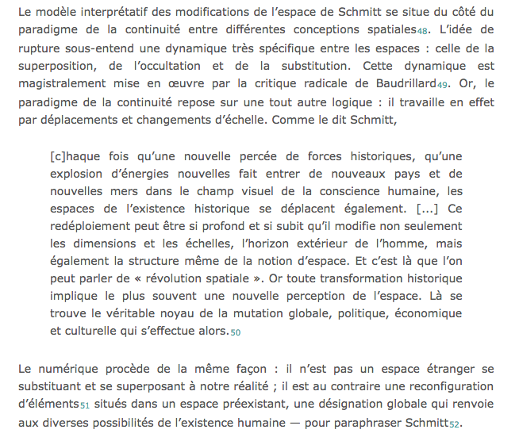

 
 
# PARALITTÉRATURES
## FRA 2284
 
###### Enrico Agostini-Marchese
<small>enrico.agostini.marchese@umontreal.ca</small>
 
_Université de Montréal_
 
 
<small>HIVER 2018</small>
%%%%%%%%%%%%%%%%%%%%%%%%%%%%%%%%%%%%%%%%%%%%%
<h2>CALENDRIER</h2>
<ul>
<li>12 janvier : <b>Introduction - Qu'est-ce que la paralittérature ?</b></li>
<li>19 janvier : <b>Littérature numérique et éléments de paralittérature : auteur, série, genre</b></li>
<li>26 janvier : <b>Éléments de paralittérature 2</b></li>
<li>2 février :  <b>Bande dessinée</b></li>
<li>9 février : <b>Policier</b></li>
<li>16 février : <b>Marcello Vitali-Rosati : Littérature érotique et fan-fiction</b></li>
<li>23 février : <b>EXAMEN SUR TABLE</b></li>
<li>2 mars : <b>Servanne Monjour : Photo-roman</b></li>
<li>16 mars : <b>Benoit Bordeleau : Tenir l'écart: discrétion (para)littéraire et pratiques fragmentaires</b></li>
<li>23 mars : <b>Marta Boni : Le feuilleton contemporain : les séries télé</b></li>
<li>6 avril : <b>Marie Demers : Littérature jeunes adultes</b></li>
<li>13 avril : <b>EXAMEN SUR TABLE</b></li>
<li>23 avril : <b>TRAVAIL FINAL</b></li>
</ul>
§§§§§§§§§§§§§§§§§§§§§§§§§§§§§§§§§§§§§§§§§§§§§
### EXAMEN SUR TABLE
1 question théorique
 
2 questions sur les œuvres analysées dans le cours
 
 
10 lignes par question
 
 
ÉVALUATION - 25% de la note finale
§§§§§§§§§§§§§§§§§§§§§§§§§§§§§§§§§§§§§§§§§§§§§
### TRAVAIL FINAL
Analyse d'un objet paralittéraire
 
 
5 pages, max
 
 
ÉVALUATION - 50% de la note finale
%%%%%%%%%%%%%%%%%%%%%%%%%%%%%%%%%%%%%%%%%%%%%
### PLAGIAT

« Le plagiat est l'acte de faire passer pour siens les textes ou les idées d’autrui »
 
 
<ul>
<li>l’utilisation totale ou partielle d’un texte d’autrui en le faisant passer pour sien ou sans indication de référence à l’occasion d’un examen, d’un travail ou d’une activité faisant l’objet d’une évaluation;</li>
<li>l’exécution par une autre personne d’un travail ou d’une activité faisant l’objet d’une évaluation;</li>
<li>le recours à toute aide non autorisée à l’occasion d’un examen ou pour la réalisation d’un travail;</li>
<li>la présentation, sans autorisation, d’un même travail dans différents cours;</li>
<li>l’obtention par moyen illicite de questions ou de réponses d’examen;</li>
<li>la sollicitation, l’offre ou l’échange d’information pendant un examen.</li>
</ul>
 
 
http://secretariatgeneral.umontreal.ca/fileadmin/secretariat/Documents/Reglements/ens30_3-reglement-disciplinaire-plagiat-fraude-etudiants-premier-cycle.pdf

%%%%%%%%%%%%%%%%%%%%%%%%%%%%%%%%%%%%%%%%%%%%%
### NORMES DE CITATION

2 styles principaux :
<ul>
<li>Auteur-date</li>
<li>Classique</li>
</ul>
§§§§§§§§§§§§§§§§§§§§§§§§§§§§§§§§§§§§§§§§§§§§§
### Auteur-date

Dans le corps du texte, pas de note de bas de page
 
 
(Auteur date, page)
 
 
Je pense que l'incipit d'<i>Aurélien</i> de Louis Aragon, « La première fois qu'Aurélien vit Bérénice, il la trouva franchement laide » (Aragon 1976, 5), est le plus bel incipit de la littérature française.
 
 
À la fin du livre ou de l'article : index des auteur.e.s cité.e.s
§§§§§§§§§§§§§§§§§§§§§§§§§§§§§§§§§§§§§§§§§§§§§
### Classique
Notes de bas de page
 
 
Je pense que l'incipit d'<i>Aurélien</i> de Louis Aragon, « La première fois qu'Aurélien vit Bérénice, il la trouva franchement laide »<small>1</small>, est le plus bel incipit de la littérature française.
 
 
 
 
<small>1 Louis Aragon, <i>Aurélien</i>, Paris, Gallimard, 1976, p. 5.</small>
§§§§§§§§§§§§§§§§§§§§§§§§§§§§§§§§§§§§§§§§§§§§§
### Classique
Réproduire la citation intégrale entre guillemets, avec la ponctuation et même, le cas où, les fautes, suivie de [<i>sic</i>]
 
 
Le prof, dans ses diapositives, a écrit : « les fautes, suivie [<i>sic</i>] » au lieu de « suivies. »
 
 
Dans le cas d'une citation de quatre lignes ou plus - dite citation longue - il faut l'insérer comme paragraphe autonome, sans guillements ni italique, avec la même police mais de taille diminuée et interligne simple et avec mise en retrait.
§§§§§§§§§§§§§§§§§§§§§§§§§§§§§§§§§§§§§§§§§§§§§

§§§§§§§§§§§§§§§§§§§§§§§§§§§§§§§§§§§§§§§§§§§§§
### Classique - Citation dans une citation

On utilise les guillemets anglais : "..."

Le prof a dit qu'il « pense que l'incipit d'<i>Aurélien</i> de Louis Aragon, "La première fois qu'Aurélien vit Bérénice, il la trouva franchement laide"<small>1</small>, est le plus bel incipit de la littérature française. »
§§§§§§§§§§§§§§§§§§§§§§§§§§§§§§§§§§§§§§§§§§§§§
### Classique - Ajout et retrait

<small>Parfois, dans une citation, on a besoin de changer, ajouter ou enlever des choses. On rend manifeste toute intervention en utilisant les paranthèses carrées : [ ]
 
 

« le roman-feuilleton du XIXe siècle [est][…] au contraire l’origine du grand roman “original” à la manière de Balzac ou de Dostoïevski ; et qu’en outre le roman-feuilleton dans le style des <i>Mystères de Paris</i> développe une nouvelle mythologie de la civilisation urbaine<small>1</small> »

 1 Hans Robert Jauss, <i>Pour une esthétique de la réception</i>, Paris, Gallimard, 1978, p. 120.
  
Quand on veut mettre en évidence des mots dans la citation, on utilise <b>dans la citation</b> l'italique et on ajoute à la note de bas de page <i>(C'est moi qui souligne)</i>
 
 
« le roman-feuilleton du XIXe siècle [est][…] au contraire l’origine du <i>grand</i> roman “original” à la manière de Balzac ou de Dostoïevski<small>1</small> »
 
 1 Hans Robert Jauss, <i>Pour une esthétique de la réception</i>, Paris, Gallimard, 1978, p. 120. (C'est moi qui souligne)
</small>
§§§§§§§§§§§§§§§§§§§§§§§§§§§§§§§§§§§§§§§§§§§§§
### Classique - Ajout et retrait II

<small>Les parenthèses carrées sont utilisées aussi pour préciser des éléments de la citation ou pour introduire la citation elle-même.
 
 
« dans cette province francophone du Canada [le Québec], il y a 8 millions d'habitants »
 
 
« La première fois qu'Aurélien vit Bérénice, il la trouva franchement laide », incipit d'<i>Aurélien</i> de Louis Aragon, est à mon avis le plus bel incipit de la littérature française.
 
 
Je pense que l'incipit d'<i>Aurélien</i> de Louis Aragon, « [l]a première fois qu'Aurélien vit Bérénice, il la trouva franchement laide », est le plus bel incipit de la littérature française.
 
 
« [...] il la trouva franchement laide » c'est la phrase qui fait de l'incipit d'<i>Aurélien</i> de Louis Aragon le plus bel incipit de la littérature française</small>
§§§§§§§§§§§§§§§§§§§§§§§§§§§§§§§§§§§§§§§§§§§§§
#### Classique - Monographies et livres
<small>
<ul>
<li>Un auteur : Prénom Nom, <i>Titre</i>, lieu de publication, maison d'édition, année, page.</li>
<li>Deux auteurs : Prénom1 Nom1 et Prénom2 Nom2, <i>Titre</i>, lieu de publication, maison d'édition, année, page.</li>
<li>Trois auteurs : Prénom1 Nom1, Prénom2 Nom2 et Prénom3 Nom3, <i>Titre</i>, lieu de publication, maison d'édition, année, page.</li>
<li>Quatre auteurs ou plus : Prénom1 Nom1 et autres, <i>Titre</i>, lieu de publication, maison d'édition, année, page.</li>
<li>Collectif/Entité collective : Nom du collectif, <i>Titre</i>, lieu de publication, maison d'édition, année, page.</li>
<li>Ouvrage collectif dirigé par une personne : Prénom Nom (dir.), <i>Titre</i>, lieu de publication, maison d'édition, année, page.</li>
<li>Entrée d'encyclopédie, dictionnaire ou autre entrée <b>sans auteur</b> : « entrée », entrée de <i>Titre</i>, lieu de publication, maison d'édition, année, page.</li>
<li> Thèse et mémoire : Prénom Nom, <i>Titre</i>, thèse (Ph.D.)/mémoire en ..., Université, année, page.</li>
</ul>
</small>
§§§§§§§§§§§§§§§§§§§§§§§§§§§§§§§§§§§§§§§§§§§§§
### Classique - Chapitres, parties de livres et articles
<small>
<ul>
<li>Un auteur : Prénom Nom, « Titre du chapitre », dans Prénom Nom de l'auteur, <i>Titre</i>, lieu de publication, maison d'édition, année, page.</li>
<li>Un auteur dans un ouvrage collectif : Prénom Nom, « Titre du chapitre », dans Prénom Nom du directeur (dir.), <i>Titre</i>, lieu de publication, maison d'édition, année, page.</li>
<li>Entrée d'encyclopédie, dictionnaire ou autre entrée <b>avec auteur</b> : Prénom Nom, « entrée », dans <i>Titre</i>, lieu de publication, maison d'édition, année, page.</li>
<li>Auteur d'un article : Prénom Nom, « Titre de l’article :
sous-titre », <i>titre de la révue : sous-titre</i>, volume, numéro, jour
mois, année, page.</li>
</ul>
</small>
§§§§§§§§§§§§§§§§§§§§§§§§§§§§§§§§§§§§§§§§§§§§§
### Classique - Documents numériques
<ul>
<li>Site Web <b>sans auteur</b> : <i>Nom du site</i>. [En ligne : adresse] (consulté le jj/mm/aaaa)</li>
<li>Site Web <b>avec auteur</b> : Prénom Nom, <i>Nom du site</i>. [En ligne : adresse] (consulté le jj/mm/aaaa)</li>
<li>Page d'un site Web <b>sans auteur</b> : « nom de la page » dans <i>nom du site</i>. [En ligne : adresse] (consulté le jj/mm/aaaa)</li>
<li>Page d'un site Web <b>avec auteur</b> : Prénom Nom, « nom de la page » dans <i>nom du site</i>. [En ligne : adresse] (consulté le jj/mm/aaaa)</li>
</ul>
§§§§§§§§§§§§§§§§§§§§§§§§§§§§§§§§§§§§§§§§§§§§§
### Classique - Documents numériques II
<small>
<ul>
<li>Un auteur : Prénom Nom, <i>Titre</i>, lieu de publication, maison d'édition, année, page. [En ligne : adresse] (consulté le jj/mm/aaaa)</li>
<li>Collectif/Entité collective : Nom du collectif, <i>Titre</i>, lieu de publication, maison d'édition, année, page.</li>
<li>Ouvrage collectif dirigé par une personne : Prénom Nom (dir.), <i>Titre</i>, lieu de publication, maison d'édition, année, page. [En ligne : adresse] (consulté le jj/mm/aaaa)</li>
<li>Entrée d'encyclopédie, dictionnaire ou autre entrée <b>sans auteur</b> : « entrée », entrée de <i>Titre</i>, lieu de publication, maison d'édition, année, page. [En ligne : adresse] (consulté le jj/mm/aaaa)</li>
<li> Thèse et mémoire : Prénom Nom, <i>Titre</i>, thèse (Ph.D.)/mémoire en ..., Université, année, page. [En ligne : adresse] (consulté le jj/mm/aaaa)</li>
<li>Auteur d'un article : Prénom Nom, « Titre de l’article :
sous-titre », <i>titre de la révue : sous-titre</i>, volume, numéro, jour
mois année, page, doi. [En ligne : adresse] (consulté le jj/mm/aaaa)</li>
</ul>
</small>
§§§§§§§§§§§§§§§§§§§§§§§§§§§§§§§§§§§§§§§§§§§§§
#### Classique - Documents numérique III
<small>
<ul>
<li>Ebook : Prénom Nom, <i>Titre</i>, lieu de publication, maison d'édition, année, page <b>ou</b> [Édition numérique consultée non paginée].</li>
<li>Billet de blog : Prénom Nom, « titre du billet »/billet sans nom dans <i>titre du blog</i>, publié le jj/mm/aaaa. [En ligne : adresse] (consulté le jj/mm/aaaa)</li>
<li>Tweet : Prénom Nom (nom Twitter), Billet Twitter, publié le jj/mm/aaaa (consulté le jj/mm/aaaa)</li>
<li>Billet Facebook : Nom usager, Billet Facebook, publié le jj/mm/aaaa (consulté le jj/mm/aaaa)</li>
<li>Vidéo YouTube : Nom usager, « titre de la vidéo », Vidéo YouTube. [En ligne : adresse] (consulté le jj/mm/aaaa)</li>
<li>Application : auteur/compagnie, <i>Nom de l'application</i>, téléchargeable/disponible pour iOS/Android, version actuelle, année.</li>
<li>Entrée d'encyclopédie, dictionnaire ou autre entrée <b>sans auteur</b> : « entrée », entrée <i>Titre</i>. [En ligne : adresse] (consulté le jj/mm/aaaa)</li>
</ul>
</small>
§§§§§§§§§§§§§§§§§§§§§§§§§§§§§§§§§§§§§§§§§§§§§
### Abbréviations
<small>
<ul>
<li>Citer le même auteur pour la deuxième fois : Hans Robert Jauss --> H.S. Jauss</li>
<li>Citer le même document pour la deuxième fois : P. Nom, <i>titre</i>/« titre », op. cit., page</li>
<li>Ibid. : pour citer le même document de la note précedente</li>
<li>Cf. : voir. Pour indiquer de façon générale un document à consulter</li>
</ul>
</small>
§§§§§§§§§§§§§§§§§§§§§§§§§§§§§§§§§§§§§§§§§§§§§
### Bibliographie
<small>
Différencier les sections selon le type de document : bibliographie, webographie, vidéographie, ...
 
 
Inverser Prénom et nom et enlever les indications des pages, dates de consultation, ... :
<ul>
<li>NOM, Prénom de l'auteur, <i>Titre</i>, lieu de publication, maison d'édition, année.</li>
<li>Pour les articles : NOM, Prénom, « Titre de l’article :
sous-titre », <i>titre de la révue : sous-titre</i>, volume, numéro, jour
mois année, <b>pages</b>.</li>
<li>NOM, Prénom, <i>Titre</i>, lieu de publication, maison d'édition, année. [En ligne : adresse]</li>
</small>
%%%%%%%%%%%%%%%%%%%%%%%%%%%%%%%%%%%%%%%%%%%%%
# Qu'est-ce que la paralittérature ?
§§§§§§§§§§§§§§§§§§§§§§§§§§§§§§§§§§§§§§§§§§§§§
## Para

Du grec « παρά » : à côté de, en marge, presque
 
 
Exemples ; para-médical, para-normal, para-texte
§§§§§§§§§§§§§§§§§§§§§§§§§§§§§§§§§§§§§§§§§§§§§
## Littérature
Qu'est-ce que la littérature ? Question majeure dans l'histoire culturelle occidentale
 
 
<small>
« Le mot littérature, issu du latin <i>litteratura</i> dérivé de <i>littera</i> (la lettre), apparaît au début du XIIIe siècle avec un sens technique de "chose écrite" puis évolue à la fin du Moyen Âge vers le sens de "savoir tiré des livres", avant d'atteindre aux XVIIe – XVIIIe siècles son sens principal actuel : ensemble des œuvres écrites ou orales comportant une dimension esthétique »
 
 
« Littérature », entrée <i>Wikipédia</i>. [En ligne : https://fr.wikipedia.org/wiki/Litt%C3%A9rature] (consulté le 08/01/2018)
</small>
§§§§§§§§§§§§§§§§§§§§§§§§§§§§§§§§§§§§§§§§§§§§§
## S

<ul>
<li>Département de Littératures de langue française</li>
<li>Alain-Michel Boyer :
<ul>
<li><i>La paralittérature</i>, Paris, PUF, 1992</li>
<li><i>Les paralittératures</i>, Paris, Armand Colin, 2008</i></li>
</ul>
<li>Pourquoi introduire le pluriel ?</li>
<li>Se réfère-t-il à « Littérature » ou à « Paralittérature » ?</li>
<li>Conséquences du pluriel dans « Littératures » ?</li>
<li>Conséquences du pluriel dans « Paralittératures »</li>
</ul>
§§§§§§§§§§§§§§§§§§§§§§§§§§§§§§§§§§§§§§§§§§§§§
### Plusieurs questions
##### Littérature
  <ul>
  <li>La <b>L</b>ittérature ou la <b>l</b>ittérature ? - Valeur culturelle au sens large</li>
  <li>Définition descriptive ou prescriptive ?</li>
    <ul>
    <li>Descriptive : Ce que la littérature <b>est</b></li>
    <li>Prescriptive : Ce que la littéature <b>devrait</b> être</li>
    </ul>
  <li>Approches différentes selon l'époque, les modes et les pensées</li>
  <li>Institutionnalisation de la littérature : qui décide de la valeur esthétique d'une œuvre ?</li>
  </ul>
§§§§§§§§§§§§§§§§§§§§§§§§§§§§§§§§§§§§§§§§§§§§§
##### Paralittérature
<ul>
<li>Définition qui dérive de celle de littérature</li>
<li>Classiques (<b>L</b>ittérature) vs Œuvres mineures (paralittérature ou <b>l</b>ittérature ?)</li>
<li>Type de littérature non innovante ?</li>
<li>Littérature sans valeur esthétique ? Littérature de masse, commerciale, populaire, de genre, récréative, ...</li>
<li>Hétérogénéité du support paralittéraire</li>
</ul>
§§§§§§§§§§§§§§§§§§§§§§§§§§§§§§§§§§§§§§§§§§§§§
<b>L</b>ittérature vs littérature

<small>La Littérature, en tant qu'ensemble composé de chefs-d'œuvre, est une idée très récente : autour du XVIIe-XVIIIe siècles, quand, en Europe, on commençait à développer l'idée d'identité nationale.
 
 
« Le but suprême de ces patriarches [les grands historiens de la littérature] : représenter, à travers l’histoire des produits de sa littérature, l’essence d’une entité nationale en quête d’elle-même »
 
 
H.R. Jauss, <i>Pour une esthétique de la réception</i>, op. cit., p. 23.
 
 
« [L]a valeur et le rang d’une œuvre littéraire ne se déduisent ni des circonstances biographiques ou historiques de sa naissance, ni de la seule place qu’elle occupe dans l’évolution d’un genre, mais de critères bien plus difficile à manier : effet produit, “réception”, influence exercée, valeur reconnue par la postérité »
 
 
Ibid., p. 26.</small>
<!-- Alexandre Dumas -->
<!-- Stoner, John Williams -->
§§§§§§§§§§§§§§§§§§§§§§§§§§§§§§§§§§§§§§§§§§§§§
### Descriptive et prescriptive
<small>
« Nous allons parler et de la poétique elle-même et de ses espèces ; dire quel est le rôle de chacune d'elles et comment on doit constituer les fables pour que la poésie soit bonne ; puis quel est le nombre, quelle est la nature des parties qui la composent : nous traiterons pareillement des autres questions qui se rattachent au même art, et cela, en commençant d'abord par les premières dans l'ordre naturel. II. L'épopée, la poésie tragique, la comédie, la poésie dithyrambique, l'aulétique, la citharistique, en majeure partie se trouvent être toutes, au résumé, des imitations. Seulement, elles diffèrent entre elles par trois points. Leurs <i>éléments d'imitation</i> sont autres ; autres les <i>objets imités</i>, autres enfin les <i>procédés et la manière</i> dont on imite »
 
 
Aristote, <i>La poétique</i>, Paris, Le livre de poche, 1990, p. 85. (C'est moi qui souligne)
</small>
<!-- Littérature orale : Bob Dylan -->
§§§§§§§§§§§§§§§§§§§§§§§§§§§§§§§§§§§§§§§§§§§§§
### Classique et œuvre mineure
Si les classiques font partie de la Littérature, les œuvres mineures ?
 
 
Sainte Beuve : « Auteur ancien, déjà consacré dans l'admiration et qui fait autorité en son genre », 1850
 
 
http://www.la-pleiade.fr/Le-catalogue/Par-numero
<!-- Kundera -->
§§§§§§§§§§§§§§§§§§§§§§§§§§§§§§§§§§§§§§§§§§§§§
### Institutionnalisation littéraire
§§§§§§§§§§§§§§§§§§§§§§§§§§§§§§§§§§§§§§§§§§§§§
### Œuvres non innovantes
Selon le philosophe Jacques Rancière, l'écriture et le style de Flaubert marquent le passage à l'esthétique moderne et contemporaine.
 
 
<i>Madame Bovary</i> de Flaubert parut d'abord comme feuilleton dans la <i>Revue de Paris</i> en 1856
§§§§§§§§§§§§§§§§§§§§§§§§§§§§§§§§§§§§§§§§§§§§§
### Variété des supports
<small>
« La production paralittéraire est prise aujourd’hui dans un réseau de <i>médias hétérogènes</i>. […] La notion de genre narratif dépasse dès lors le champ du discours écrit et doit être prise dans une totalité d’<i>intermédia</i> »
 Marc Angenot, « Qu'est-ce que la paralittérature ? »
 
 
« La problématique de cette étude s’inscrit dans le contexte de la seconde moitié du XXe siècle. […] Parmi d’autres facteurs peut-être plus scientifiques, on peut considérer que le développement d’une civilisation occidentale “multimédia” n’a pas été sans relations avec celui des réflexions […] sur le concept de “littérarité”. […] Au cours des années 60, l’affrontement entre tenants d’une doxa littéraire institutionnelle et contestataires partisans d’une “nouvelle critique” à prétentions scientifiques se déroulait sur fond de développement de l’édition et surtout de la télévision »
 Daniel Couégnas, <i>Introduction à la paralittérature</i>, Paris, Seuil, 1992, p. 20</small>
§§§§§§§§§§§§§§§§§§§§§§§§§§§§§§§§§§§§§§§§§§§§§
### Expressions pour caractériser la paralittérature :
- Mode de production (grande diffusion, grand tirage, de masse)
- Causes de la production
- Mode de publication (feuilleton)
- Circuit de distribution (gare, supermarché)
- Nature du papier employé
- Prix des livres ou des fascicules
- Nature du consommateur
- Nature de la consommation
§§§§§§§§§§§§§§§§§§§§§§§§§§§§§§§§§§§§§§§§§§§§§
<ul>
<li>Production du contenu</li>
<li>Diffusion du contenu</li>
<li>Légitimation du contenu</li>
</ul>
<!-- Conception "opératoire" de paralittérature (A.-M. Boyer) , Je suggère donc d’analyser les présupposés du concept de “paralittérature” plutôt que de coller des étiquettes sur des œuvres. […] En mettant en lumière ces critères “repoussoirs”, il est clair que nous ébaucherons du même coup l’image complémentaire d’un autre type de relation à l’écriture et à la lecture Couégnas
[Le concept de paralittérature] doit être considéré comme un instrument d’analyse, qui a pour objet de saper les certitudes des institutions, une notion limite, qui suscite un nouveau type de raisonnement sur la création, un concept opératoire, grâce auquel, sans que l’on puisse se satisfaire d’une telle dichotomie, et sans qu’elle reflète nécessairement une distribution sociale des cultures, il devient p. 10 possible de questionner les deux ensembles littérature/paralittérature l’un par l’autre » p. 11 -->
%%%%%%%%%%%%%%%%%%%%%%%%%%%%%%%%%%%%%%%%%%%%%
#### Platon, <i>Phèdre</i>

« Je le connais ; et je suis sûr qu’assistant à une lecture de Lysias, il ne s’est pas contenté de l’entendre une seule fois ; il a souvent prié le lecteur de recommencer, et celui-ci s’est empressé de le satisfaire. Cela même n’a pas été assez pour lui ; il a fini par s’emparer du cahier, pour relire ce qui l’avait le plus intéressé »

Socrate : « Mais qu’est-ce qu’écrire bien ou écrire mal ? Faudra-t-il, mon cher Phèdre, examiner là-dessus Lysias, ou quelqu’un de ceux qui ont écrit ou qui écriront des ouvrages sur la politique ou sur des sujets particuliers, soit en vers comme le poète, soit en style libre comme le prosateur ? »

Socrate : « Mais d’ailleurs ne trouves-tu pas que les idées sont entassées sans beaucoup d’ordre ? Ce qu’il dit en second lieu paraît-il devoir nécessairement être à cette place, et n’y pourrait-on pas substituer quelque autre partie du discours ? Il me semble, à moi, dans mon ignorance, que notre ami a bravement jeté sur le papier tout ce qui lui venait à l’esprit. Mais toi, trouves-tu dans son ouvrage un plan déterminé, d’après lequel il en ait ainsi disposé toutes les parties ? »

Socrate : « Au moins tu conviendras, je pense, que tout discours doit être composé comme un être vivant ; avoir un corps qui lui soit propre, une tête et des pieds, un milieu et des extrémités proportionnées entre elles et avec l’ensemble ? »

Socrate : « C’est de savoir de nouveau décomposer le sujet en ses différentes parties, comme en autant d’articulations naturelles, et de tâcher de ne point mutiler chaque partie comme ferait un mauvais écuyer tranchant »

Socrate : « Tu veux dire qu’en finissant on rappelle sommairement aux auditeurs chacun des motifs qu’on a développés. »

Socrate : « La vertu du discours étant d’entraîner les âmes, celui qui veut devenir orateur doit savoir combien il y a d’espèces d’âmes. Elles sont en certain nombre, et elles ont certaines qualités par lesquelles elles diffèrent les unes des autres. Cette division établie, on distingue certaines espèces de discours qui ont certaines qualités. Or, on persuade aisément à telles ou telles âmes telle ou telle chose par tels discours, pour tels motifs, tandis qu’à telles autres il est difficile de persuader telle ou telle chose. Il faut que l’orateur suffisamment instruit de tous ces détails puisse ensuite les retrouver dans toutes les actions, dans toutes les circonstances de la vie, et les y démêler d’un coup d’œil rapide, ou bien il doit se résoudre à n’en savoir jamais plus que ce qu’il a appris de ses maîtres, lorsqu’il suivait leurs leçons. Quand il sera capable de dire quels discours peuvent opérer la conviction et sur qui, et que, rencontrant un individu, il pourra le pénétrer soudain et se dire à soi-même, voilà bien une âme de telle nature, telle qu’on me la dépeignait ; la voilà présente devant moi, et pour lui persuader telle ou telle chose, je vais lui adresser tel ou tel langage ; quand il aura acquis toutes ces connaissances, et que de plus il saura quand il faut parler et quand se taire, quand employer ou quitter le ton sentencieux, le ton plaintif, l’amplification, et toutes les espèces de discours qu’il aura étudiées, de manière qu’il soit sûr de placer à propos toutes ces choses et de s’en abstenir à temps, il possédera parfaitement l’art de la parole ; jusque-là non : et quiconque, soit en parlant, soit en enseignant, soit en écrivant, oublie quelqu’une de ces règles, et prétend parler avec art, on à raison de ne pas le croire. »

Socrate : « Maintenant ne nous reste-t-il pas à parler sur la convenance ou l’inconvenance qu’il peut y avoir à écrire ? Que t’en semble ? [...] Sais-tu comment on peut être le plus agréable à Dieu par ses discours, écrits ou parlés ? »

Socrate : « Il serait trop long de les parcourir ; mais lorsqu’ils en furent à l’écriture : Cette science, ô roi ! lui dit Theuth, rendra les Égyptiens plus savans et soulagera leur mémoire. C’est un remède que j’ai trouvé contre la difficulté d’apprendre et de savoir. Le roi répondit : Industrieux Theuth, tel homme est capable d’enfanter les arts, tel autre d’apprécier les avantages ou les désavantages qui peuvent résulter de leur emploi ; et toi, père de l’écriture, par une bienveillance naturelle pour ton ouvrage, tu l’as vu tout autre qu’il n’est : il ne produira que l’oubli dans l’esprit de ceux qui apprennent, en leur faisant négliger la mémoire. En effet, ils laisseront à ces caractères étrangers le soin de leur rappeler ce qu’ils auront confié à l’écriture, et n’en garderont eux-mêmes aucun souvenir. Tu n’as donc point trouvé un moyen pour la mémoire, mais pour la simple réminiscence, et tu n’offres à tes disciples que le nom de la science sans la réalité ; car, lorsqu’ils auront lu beaucoup de choses sans maîtres, ils se croiront de nombreuses connaissances, tout ignorants qu’ils seront pour la plupart, et la fausse opinion qu’ils auront de leur science les rendra insupportables dans le commerce de la vie. »

Socrate : « Celui donc qui prétend laisser l’art consigné dans les pages d’un livre, et celui qui croit l’y puiser, comme s’il pouvait sortir d’un écrit quelque chose de clair et de solide, me paraît d’une grande simplicité ; et vraiment il ignore l’oracle d’Ammon, s’il croit que des discours écrits soient quelque chose de plus qu’un moyen de réminiscence pour celui qui connaît déjà le sujet qu’ils traitent.[...] Car voici l’inconvénient de l’écriture, mon cher Phèdre, comme de la peinture. Les productions de ce dernier art semblent vivantes ; mais interrogez-les, elles vous répondront par un grave silence. Il en est de même des discours écrits : vous croiriez, à les entendre, qu’ils sont bien savants ; mais questionnez-les sur quelqu’une des choses qu’ils contiennent, ils vous feront toujours la même réponse. Une fois écrit, un discours roule de tous côtés, dans les mains de ceux qui le comprennent comme de ceux pour qui il n’est pas fait, et il ne sait pas même à qui il doit parler, avec qui il doit se taire. Méprisé ou attaqué injustement, il a toujours besoin que son père vienne à son secours ; car il ne peut ni résister ni se secourir lui-même. »

Socrate : « Mais suppose un homme qui pense que dans tout discours écrit, n’importe sur quel sujet, il doit toujours y avoir beaucoup de badinage ; qu’aucun discours écrit ou prononcé, soit en vers, soit en prose, ne doit être regardé comme quelque chose de bien sérieux (à peu près comme ces morceaux qui se récitent sans discernement et sans dessein d’instruire, dans le seul but de plaire), et qu’en effet les meilleurs discours écrits ne sont qu’un moyen de réminiscence pour les hommes qui savent déjà ; suppose qu’il pense encore que dans les discours destinés à instruire, véritablement écrits dans l’âme, et qui ont pour sujet le juste, le beau et le bon, dans ceux-là seuls se trouvent réunis la clarté, la perfection et le sérieux, et que de tels discours sont les enfants légitimes de leur auteur, d’abord ceux qu’il produit lui-même, puis ceux qui, enfants ou frères des premiers, naissent dans d’autres âmes sans démentir leur origine, suppose enfin qu’il ne reconnaît que ceux là et rejette avec mépris tous les autres, cet homme pourra bien être tel que Phèdre et moi nous souhaiterions de devenir. »
%%%%%%%%%%%%%%%%%%%%%%%%%%%%%%%%%%%%%%%%%%%%%
#### Umberto Eco, <i>Le nom de la rose</i>
<iframe src="https://archive.org/details/nom-de-la-rose" width="640" height="480" frameborder="0" webkitallowfullscreen="true" mozallowfullscreen="true" allowfullscreen></iframe>
