 
 
# PARALITTÉRATURES
## FRA 2284
 
###### Enrico Agostini-Marchese
<small>enrico.agostini.marchese@umontreal.ca</small>
 
_Université de Montréal_
 
 
<small>HIVER 2018</small>

%%%%%%%%%%%%%%%%%%%%%%%%%%%%%%%%%%%%%%%%%%%%%

<h2>CALENDRIER</h2>
<ul>
<li>12 janvier : <b>Introduction - Qu'est-ce que la paralittérature ?</b></li>
<li>19 janvier : <b>Littérature numérique et éléments de paralittérature : auteur, série, genre</b></li>
<li>26 janvier : <b>Éléments de paralittérature 2</b></li>
<li>2 février :  <b>Bande dessinée</b></li>
<li>9 février : <b>Policier</b></li>
<li>16 février : <b>Marcello Vitali-Rosati : Littérature érotique et fan-fiction</b></li>
<li>23 février : <b>EXAMEN SUR TABLE</b></li>
<li>2 mars : <b>Servanne Monjour : Photo-roman</b></li>
<li>16 mars : <b>Benoit Bordeleau : Tenir l'écart: discrétion (para)littéraire et pratiques fragmentaires</b></li>
<li>23 mars : <b>Marta Boni : Le feuilleton contemporain : les séries télé</b></li>
<li>6 avril : <b>Marie Demers : Littérature jeunes adultes</b></li>
<li>13 avril : <b>EXAMEN SUR TABLE</b></li>
<li>23 avril : <b>TRAVAIL FINAL</b></li>
</ul>

§§§§§§§§§§§§§§§§§§§§§§§§§§§§§§§§§§§§§§§§§§§§§

### EXAMEN SUR TABLE
1 question théorique
 
2 questions sur les œuvres analysées dans le cours
 
 
10 lignes par question
 
 
ÉVALUATION - 25% de la note finale

§§§§§§§§§§§§§§§§§§§§§§§§§§§§§§§§§§§§§§§§§§§§§

### TRAVAIL FINAL
Analyse d'un objet paralittéraire
 
 
5 pages, max
 
 
ÉVALUATION - 50% de la note finale

%%%%%%%%%%%%%%%%%%%%%%%%%%%%%%%%%%%%%%%%%%%%%

### PLAGIAT

« Le plagiat est l'acte de faire passer pour siens les textes ou les idées d’autrui »
 
 
<ul>
<li>l’utilisation totale ou partielle d’un texte d’autrui en le faisant passer pour sien ou sans indication de référence à l’occasion d’un examen, d’un travail ou d’une activité faisant l’objet d’une évaluation;</li>
<li>l’exécution par une autre personne d’un travail ou d’une activité faisant l’objet d’une évaluation;</li>
<li>le recours à toute aide non autorisée à l’occasion d’un examen ou pour la réalisation d’un travail;</li>
<li>la présentation, sans autorisation, d’un même travail dans différents cours;</li>
<li>l’obtention par moyen illicite de questions ou de réponses d’examen;</li>
<li>la sollicitation, l’offre ou l’échange d’information pendant un examen.</li>
</ul>
 
 
http://secretariatgeneral.umontreal.ca/fileadmin/secretariat/Documents/Reglements/ens30_3-reglement-disciplinaire-plagiat-fraude-etudiants-premier-cycle.pdf

%%%%%%%%%%%%%%%%%%%%%%%%%%%%%%%%%%%%%%%%%%%%%

### NORMES DE CITATION

2 styles principaux :
<ul>
<li>Auteur-date</li>
<li>Classique</li>
</ul>

§§§§§§§§§§§§§§§§§§§§§§§§§§§§§§§§§§§§§§§§§§§§§

### Auteur-date

Dans le corps du texte, pas de note de bas de page
 
 
(Auteur date, page)
 
 
Je pense que l'incipit d'<i>Aurélien</i> de Louis Aragon, « La première fois qu'Aurélien vit Bérénice, il la trouva franchement laide » (Aragon 1976, 5), est le plus bel incipit de la littérature française.
 
 
À la fin du livre ou de l'article : index des auteur.e.s cité.e.s

§§§§§§§§§§§§§§§§§§§§§§§§§§§§§§§§§§§§§§§§§§§§§

### Classique
Notes de bas de page
 
 
Je pense que l'incipit d'<i>Aurélien</i> de Louis Aragon, « La première fois qu'Aurélien vit Bérénice, il la trouva franchement laide »<small>1</small>, est le plus bel incipit de la littérature française.
 
 
 
 
<small>1 Louis Aragon, <i>Aurélien</i>, Paris, Gallimard, 1976, p. 5.</small>

§§§§§§§§§§§§§§§§§§§§§§§§§§§§§§§§§§§§§§§§§§§§§

### Classique
Reproduire la citation intégrale entre guillemets, avec la ponctuation et même, le cas où, les fautes, suivie de [<i>sic</i>]
 
 
Le prof, dans ses diapositives, a écrit : « les fautes, suivie [<i>sic</i>] » au lieu de « suivies. »
 
 
Dans le cas d'une citation de quatre lignes ou plus - dite citation longue - il faut l'insérer comme paragraphe autonome, sans guillements ni italique, avec la même police mais de taille diminuée et interligne simple et avec mise en retrait.

§§§§§§§§§§§§§§§§§§§§§§§§§§§§§§§§§§§§§§§§§§§§§

§§§§§§§§§§§§§§§§§§§§§§§§§§§§§§§§§§§§§§§§§§§§§

### Classique - Citation dans une citation

On utilise les guillemets anglais : "..."

Le prof a dit qu'il « pense que l'incipit d'<i>Aurélien</i> de Louis Aragon, "La première fois qu'Aurélien vit Bérénice, il la trouva franchement laide"<small>1</small>, est le plus bel incipit de la littérature française. »

§§§§§§§§§§§§§§§§§§§§§§§§§§§§§§§§§§§§§§§§§§§§§

### Classique - Ajout et retrait

<small>Parfois, dans une citation, on a besoin de changer, ajouter ou enlever des choses. On rend manifeste toute intervention en utilisant les parenthèses carrées : [ ]
 
 

« le roman-feuilleton du XIXe siècle [est][…] au contraire l’origine du grand roman “original” à la manière de Balzac ou de Dostoïevski ; et qu’en outre le roman-feuilleton dans le style des <i>Mystères de Paris</i> développe une nouvelle mythologie de la civilisation urbaine<small>1</small> »

 1 Hans Robert Jauss, <i>Pour une esthétique de la réception</i>, Paris, Gallimard, 1978, p. 120.
  
Quand on veut mettre en évidence des mots dans la citation, on utilise <b>dans la citation</b> l'italique et on ajoute à la note de bas de page <i>(C'est moi qui souligne)</i>
 
 
« le roman-feuilleton du XIXe siècle [est][…] au contraire l’origine du <i>grand</i> roman “original” à la manière de Balzac ou de Dostoïevski<small>1</small> »
 
 1 Hans Robert Jauss, <i>Pour une esthétique de la réception</i>, Paris, Gallimard, 1978, p. 120. (C'est moi qui souligne)
</small>

§§§§§§§§§§§§§§§§§§§§§§§§§§§§§§§§§§§§§§§§§§§§§

### Classique - Ajout et retrait II

<small>Les parenthèses carrées sont utilisées aussi pour préciser des éléments de la citation ou pour introduire la citation elle-même.
 
 
« dans cette province francophone du Canada [le Québec], il y a 8 millions d'habitants »
 
 
« La première fois qu'Aurélien vit Bérénice, il la trouva franchement laide », incipit d'<i>Aurélien</i> de Louis Aragon, est à mon avis le plus bel incipit de la littérature française.
 
 
Je pense que l'incipit d'<i>Aurélien</i> de Louis Aragon, « [l]a première fois qu'Aurélien vit Bérénice, il la trouva franchement laide », est le plus bel incipit de la littérature française.
 
 
« [...] il la trouva franchement laide » c'est la phrase qui fait de l'incipit d'<i>Aurélien</i> de Louis Aragon le plus bel incipit de la littérature française</small>

§§§§§§§§§§§§§§§§§§§§§§§§§§§§§§§§§§§§§§§§§§§§§

#### Classique - Monographies et livres
<small>
<ul>
<li>Un auteur : Prénom Nom, <i>Titre</i>, lieu de publication, maison d'édition, année, page.</li>
<li>Deux auteurs : Prénom1 Nom1 et Prénom2 Nom2, <i>Titre</i>, lieu de publication, maison d'édition, année, page.</li>
<li>Trois auteurs : Prénom1 Nom1, Prénom2 Nom2 et Prénom3 Nom3, <i>Titre</i>, lieu de publication, maison d'édition, année, page.</li>
<li>Quatre auteurs ou plus : Prénom1 Nom1 et autres, <i>Titre</i>, lieu de publication, maison d'édition, année, page.</li>
<li>Collectif/Entité collective : Nom du collectif, <i>Titre</i>, lieu de publication, maison d'édition, année, page.</li>
<li>Ouvrage collectif dirigé par une personne : Prénom Nom (dir.), <i>Titre</i>, lieu de publication, maison d'édition, année, page.</li>
<li>Entrée d'encyclopédie, dictionnaire ou autre entrée <b>sans auteur</b> : « entrée », entrée de <i>Titre</i>, lieu de publication, maison d'édition, année, page.</li>
<li> Thèse et mémoire : Prénom Nom, <i>Titre</i>, thèse (Ph.D.)/mémoire en ..., Université, année, page.</li>
</ul>
</small>

§§§§§§§§§§§§§§§§§§§§§§§§§§§§§§§§§§§§§§§§§§§§§

### Classique - Chapitres, parties de livres et articles
<small>
<ul>
<li>Un auteur : Prénom Nom, « Titre du chapitre », dans Prénom Nom de l'auteur, <i>Titre</i>, lieu de publication, maison d'édition, année, page.</li>
<li>Un auteur dans un ouvrage collectif : Prénom Nom, « Titre du chapitre », dans Prénom Nom du directeur (dir.), <i>Titre</i>, lieu de publication, maison d'édition, année, page.</li>
<li>Entrée d'encyclopédie, dictionnaire ou autre entrée <b>avec auteur</b> : Prénom Nom, « entrée », dans <i>Titre</i>, lieu de publication, maison d'édition, année, page.</li>
<li>Auteur d'un article : Prénom Nom, « Titre de l’article :
sous-titre », <i>titre de la revue : sous-titre</i>, dossier spécial, volume, numéro, jour
mois, année, page.</li>
</ul>
</small>

§§§§§§§§§§§§§§§§§§§§§§§§§§§§§§§§§§§§§§§§§§§§§

### Classique - Documents numériques
<ul>
<li>Site Web <b>sans auteur</b> : <i>Nom du site</i>. [En ligne : adresse] (consulté le jj/mm/aaaa)</li>
<li>Site Web <b>avec auteur</b> : Prénom Nom, <i>Nom du site</i>. [En ligne : adresse] (consulté le jj/mm/aaaa)</li>
<li>Page d'un site Web <b>sans auteur</b> : « nom de la page » dans <i>nom du site</i>. [En ligne : adresse] (consulté le jj/mm/aaaa)</li>
<li>Page d'un site Web <b>avec auteur</b> : Prénom Nom, « nom de la page » dans <i>nom du site</i>. [En ligne : adresse] (consulté le jj/mm/aaaa)</li>
</ul>

§§§§§§§§§§§§§§§§§§§§§§§§§§§§§§§§§§§§§§§§§§§§§

### Classique - Documents numériques II
<small>
<ul>
<li>Un auteur : Prénom Nom, <i>Titre</i>, lieu de publication, maison d'édition, année, page. [En ligne : adresse] (consulté le jj/mm/aaaa)</li>
<li>Collectif/Entité collective : Nom du collectif, <i>Titre</i>, lieu de publication, maison d'édition, année, page.</li>
<li>Ouvrage collectif dirigé par une personne : Prénom Nom (dir.), <i>Titre</i>, lieu de publication, maison d'édition, année, page. [En ligne : adresse] (consulté le jj/mm/aaaa)</li>
<li>Entrée d'encyclopédie, dictionnaire ou autre entrée <b>sans auteur</b> : « entrée », entrée de <i>Titre</i>, lieu de publication, maison d'édition, année, page. [En ligne : adresse] (consulté le jj/mm/aaaa)</li>
<li> Thèse et mémoire : Prénom Nom, <i>Titre</i>, thèse (Ph.D.)/mémoire en ..., Université, année, page. [En ligne : adresse] (consulté le jj/mm/aaaa)</li>
<li>Auteur d'un article : Prénom Nom, « Titre de l’article :
sous-titre », <i>titre de la revue : sous-titre</i>, volume, numéro, jour
mois année, page, doi. [En ligne : adresse] (consulté le jj/mm/aaaa)</li>
</ul>
</small>

§§§§§§§§§§§§§§§§§§§§§§§§§§§§§§§§§§§§§§§§§§§§§

#### Classique - Documents numérique III
<small>
<ul>
<li>Ebook : Prénom Nom, <i>Titre</i>, lieu de publication, maison d'édition, année, page <b>ou</b> [Édition numérique consultée non paginée].</li>
<li>Billet de blog : Prénom Nom, « titre du billet »/billet sans nom dans <i>titre du blog</i>, publié le jj/mm/aaaa. [En ligne : adresse] (consulté le jj/mm/aaaa)</li>
<li>Tweet : Prénom Nom (nom Twitter), Billet Twitter, publié le jj/mm/aaaa (consulté le jj/mm/aaaa)</li>
<li>Billet Facebook : Nom usager, Billet Facebook, publié le jj/mm/aaaa (consulté le jj/mm/aaaa)</li>
<li>Vidéo YouTube : Nom usager, « titre de la vidéo », Vidéo YouTube. [En ligne : adresse] (consulté le jj/mm/aaaa)</li>
<li>Application : auteur/compagnie, <i>Nom de l'application</i>, téléchargeable/disponible pour iOS/Android, version actuelle, année.</li>
<li>Entrée d'encyclopédie, dictionnaire ou autre entrée <b>sans auteur</b> : « entrée », entrée <i>Titre</i>. [En ligne : adresse] (consulté le jj/mm/aaaa)</li>
</ul>
</small>

§§§§§§§§§§§§§§§§§§§§§§§§§§§§§§§§§§§§§§§§§§§§§

### Abréviations
<small>
<ul>
<li>Citer le même auteur pour la deuxième fois : Hans Robert Jauss --> H.S. Jauss</li>
<li>Citer le même document pour la deuxième fois : P. Nom, <i>titre</i>/« titre », op. cit., page</li>
<li>Ibid. : pour citer le même document de la note précédente</li>
<li>Cf. : voir. Pour indiquer de façon générale un document à consulter</li>
</ul>
</small>

§§§§§§§§§§§§§§§§§§§§§§§§§§§§§§§§§§§§§§§§§§§§§

### Bibliographie
<small>
Différencier les sections selon le type de document : bibliographie, webographie, vidéographie, ...
 
 
Inverser Prénom et nom et enlever les indications des pages, dates de consultation, ... :
<ul>
<li>NOM, Prénom de l'auteur, <i>Titre</i>, lieu de publication, maison d'édition, année.</li>
<li>Pour les articles : NOM, Prénom, « Titre de l’article :
sous-titre », <i>titre de la revue : sous-titre</i>, volume, numéro, jour
mois année, <b>pages</b>.</li>
<li>NOM, Prénom, <i>Titre</i>, lieu de publication, maison d'édition, année. [En ligne : adresse]</li>
</small>
%%%%%%%%%%%%%%%%%%%%%%%%%%%%%%%%%%%%%%%%%%%%%
# Qu'est-ce que la paralittérature ?
§§§§§§§§§§§§§§§§§§§§§§§§§§§§§§§§§§§§§§§§§§§§§
## Para

Du grec « παρά » : à côté de, en marge, presque
 
 
Exemples ; para-médical, para-normal, para-texte
§§§§§§§§§§§§§§§§§§§§§§§§§§§§§§§§§§§§§§§§§§§§§
## Littérature
Qu'est-ce que la littérature ? Question majeure dans l'histoire culturelle occidentale
 
 
<small>
« Le mot littérature, issu du latin <i>litteratura</i> dérivé de <i>littera</i> (la lettre), apparaît au début du XIIIe siècle avec un sens technique de "chose écrite" puis évolue à la fin du Moyen Âge vers le sens de "savoir tiré des livres", avant d'atteindre aux XVIIe – XVIIIe siècles son sens principal actuel : ensemble des œuvres écrites ou orales comportant une dimension esthétique »
 
 
« Littérature », entrée <i>Wikipédia</i>. [En ligne : https://fr.wikipedia.org/wiki/Litt%C3%A9rature] (consulté le 08/01/2018)
</small>
§§§§§§§§§§§§§§§§§§§§§§§§§§§§§§§§§§§§§§§§§§§§§
## S

<ul>
<li>Département de Littératures de langue française</li>
<li>Alain-Michel Boyer :
<ul>
<li><i>La paralittérature</i>, Paris, PUF, 1992</li>
<li><i>Les paralittératures</i>, Paris, Armand Colin, 2008</li>
</ul>
<li>Pourquoi introduire le pluriel ?</li>
<li>Se réfère-t-il à « Littérature » ou à « Paralittérature » ?</li>
<li>Conséquences du pluriel dans « Littératures » ?</li>
<li>Conséquences du pluriel dans « Paralittératures »</li>
</ul>
§§§§§§§§§§§§§§§§§§§§§§§§§§§§§§§§§§§§§§§§§§§§§
### Plusieurs questions
##### Littérature
  <ul>
  <li>La <b>L</b>ittérature ou la <b>l</b>ittérature ? - Valeur culturelle au sens large</li>
  <li>Définition descriptive ou prescriptive ?</li>
    <ul>
    <li>Descriptive : Ce que la littérature <b>est</b></li>
    <li>Prescriptive : Ce que la littérature <b>devrait</b> être</li>
    </ul>
  <li>Approches différentes selon l'époque, les modes et les pensées</li>
  <li>Institutionnalisation de la littérature : qui décide de la valeur esthétique d'une œuvre ?</li>
  </ul>
§§§§§§§§§§§§§§§§§§§§§§§§§§§§§§§§§§§§§§§§§§§§§
##### Paralittérature
<ul>
<li>Définition qui dérive de celle de littérature</li>
<li>Classiques (<b>L</b>ittérature) vs Œuvres mineures (paralittérature ou <b>l</b>ittérature ?)</li>
<li>Type de littérature non innovante ?</li>
<li>Littérature sans valeur esthétique ? Littérature de masse, commerciale, populaire, de genre, récréative, ...</li>
<li>Hétérogénéité du support paralittéraire</li>
</ul>
§§§§§§§§§§§§§§§§§§§§§§§§§§§§§§§§§§§§§§§§§§§§§
<b>L</b>ittérature vs littérature

<small>La Littérature, en tant qu'ensemble composé de chefs-d'œuvre, est une idée très récente : autour du XVIIe-XVIIIe siècles, quand, en Europe, on commençait à développer l'idée d'identité nationale.
 
 
« Le but suprême de ces patriarches [les grands historiens de la littérature] : représenter, à travers l’histoire des produits de sa littérature, l’essence d’une entité nationale en quête d’elle-même »
 
 
H.R. Jauss, <i>Pour une esthétique de la réception</i>, op. cit., p. 23.
 
 
« [L]a valeur et le rang d’une œuvre littéraire ne se déduisent ni des circonstances biographiques ou historiques de sa naissance, ni de la seule place qu’elle occupe dans l’évolution d’un genre, mais de critères bien plus difficile à manier : effet produit, “réception”, influence exercée, valeur reconnue par la postérité »
 
 
Ibid., p. 26.</small>
<!-- Alexandre Dumas -->
<!-- Stoner, John Williams -->
§§§§§§§§§§§§§§§§§§§§§§§§§§§§§§§§§§§§§§§§§§§§§
### Descriptive et prescriptive
<small>
« Nous allons parler et de la poétique elle-même et de ses espèces ; dire quel est le rôle de chacune d'elles et comment on doit constituer les fables pour que la poésie soit bonne ; puis quel est le nombre, quelle est la nature des parties qui la composent : nous traiterons pareillement des autres questions qui se rattachent au même art, et cela, en commençant d'abord par les premières dans l'ordre naturel. L'épopée, la poésie tragique, la comédie, la poésie dithyrambique, l'aulétique, la citharistique, en majeure partie se trouvent être toutes, au résumé, des imitations. Seulement, elles diffèrent entre elles par trois points. Leurs <i>éléments d'imitation</i> sont autres ; autres les <i>objets imités</i>, autres enfin les <i>procédés et la manière</i> dont on imite »
 
 
Aristote, <i>La poétique</i>, Paris, Le livre de poche, 1990, p. 85. (C'est moi qui souligne)
</small>
<!-- Littérature orale : Bob Dylan -->
§§§§§§§§§§§§§§§§§§§§§§§§§§§§§§§§§§§§§§§§§§§§§
### Classique et œuvre mineure
Si les classiques font partie de la Littérature, les œuvres mineures ?
 
 
Sainte Beuve : « Auteur ancien, déjà consacré dans l'admiration et qui fait autorité en son genre », 1850
 
 
http://www.la-pleiade.fr/Le-catalogue/Par-numero
<!-- Kundera -->
§§§§§§§§§§§§§§§§§§§§§§§§§§§§§§§§§§§§§§§§§§§§§
### Œuvres non innovantes
Selon le philosophe Jacques Rancière, l'écriture et le style de Flaubert marquent le passage à l'esthétique moderne et contemporaine.
 
 
<i>Madame Bovary</i> de Flaubert parut d'abord comme feuilleton dans la <i>Revue de Paris</i> en 1856
§§§§§§§§§§§§§§§§§§§§§§§§§§§§§§§§§§§§§§§§§§§§§
### Variété des supports
<small>
« La production paralittéraire est prise aujourd’hui dans un réseau de <i>médias hétérogènes</i>. […] La notion de genre narratif dépasse dès lors le champ du discours écrit et doit être prise dans une totalité d’<i>intermédia</i> »
 Marc Angenot, « Qu'est-ce que la paralittérature ? »
 
 
« La problématique de cette étude s’inscrit dans le contexte de la seconde moitié du XXe siècle. […] Parmi d’autres facteurs peut-être plus scientifiques, on peut considérer que le développement d’une civilisation occidentale “multimédia” n’a pas été sans relations avec celui des réflexions […] sur le concept de “littérarité”. […] Au cours des années 60, l’affrontement entre tenants d’une doxa littéraire institutionnelle et contestataires partisans d’une “nouvelle critique” à prétentions scientifiques se déroulait sur fond de développement de l’édition et surtout de la télévision »
 Daniel Couégnas, <i>Introduction à la paralittérature</i>, Paris, Seuil, 1992, p. 20</small>
§§§§§§§§§§§§§§§§§§§§§§§§§§§§§§§§§§§§§§§§§§§§§
### Institutionnalisation littéraire
§§§§§§§§§§§§§§§§§§§§§§§§§§§§§§§§§§§§§§§§§§§§§
### Expressions pour caractériser la paralittérature :
- Mode de production (grande diffusion, grand tirage, de masse)
- Causes de la production
- Mode de publication (feuilleton)
- Circuit de distribution (gare, supermarché)
- Nature du papier employé
- Prix des livres ou des fascicules
- Nature du consommateur
- Nature de la consommation
§§§§§§§§§§§§§§§§§§§§§§§§§§§§§§§§§§§§§§§§§§§§§
<ul>
<li>Production du contenu</li>
<li>Diffusion du contenu</li>
<li>Légitimation du contenu</li>
</ul>
%%%%%%%%%%%%%%%%%%%%%%%%%%%%%%%%%%%%%%%%%%%%%
# 19 janvier : éléments de paralittérature
%%%%%%%%%%%%%%%%%%%%%%%%%%%%%%%%%%%%%%%%%%%%%
# Approches paralittéraires
- Marc Angenot
- Daniel Couégnas
- Umberto Eco
%%%%%%%%%%%%%%%%%%%%%%%%%%%%%%%%%%%%%%%%%%%%%
<!-- .slide: data-background-image="img/angenot.jpg" -->
<!-- .element: class="givemeabackground" -->
# Marc Angenot
§§§§§§§§§§§§§§§§§§§§§§§§§§§§§§§§§§§§§§§§§§§§§
# Problématiques
- Définition
- Éléments de définition
- Idéologie et sociologie de la paralittérature
- Production et consommation
§§§§§§§§§§§§§§§§§§§§§§§§§§§§§§§§§§§§§§§§§§§§§
# Définition
 
<small>« [...] il est un vaste domaine de la production imprimée exclu du monde de la culture, domaine aujourd'hui encore très peu étudié et qui reste assez mal circonscrit » p.9
 
 
 
« [...] une masse hétéroclite d'objets “culturels” qui semblent n'avoir d'autre chose en commun que leur absence prétendue de valeur esthétique » p.9
 
 
 
« Il semble que l’on tente aujourd’hui, en forgeant le mot de “paralittérature” de rassembler en un _tout_ l’ensemble des modes d’expression langagière à caractère lyrique ou narratif que des raisons idéologiques et sociologiques maintiennent en marge de la culture lettrée »</small>

§§§§§§§§§§§§§§§§§§§§§§§§§§§§§§§§§§§§§§§§§§§§§
# Éléments de définition

- Dimension
- Procédé de publication
  - (feuilleton : « encore qu'on ait nommé “feuilletons” des récits qui n'avaient jamais paru sous cette forme »)
- Mode de distribution
- Type de consommation.

§§§§§§§§§§§§§§§§§§§§§§§§§§§§§§§§§§§§§§§§§§§§§
# Idéologie et sociologie
 
<small>
« Aussi n'est-il pas si curieux que l'on veuille parler de “paralittérature” [...] au moment où le concept traditionnel de “littérature” se brise et s'éparpille et que se constituent des regroupements singuliers dans ce domaine prétendument homogène. »

« [...] analyse interne, sémiotique, et l'analyse externe de la production et de la consommation de l'objet paralittéraire. C'est dire que notre domaine pose comme une évidence ce que la critique traditionnelle tente encore avec succès d'offusquer au moyen des pseudo-concepts de _beau_, de _génie_, de _création artistique_ et de _réalisme_. Une entreprise comme la nôtre ne peut qu’affirmer implicitement la non-pertinence des méthodes traditionnelles de la critique lettrée à un moment où ladite critique devient incapable de prolonger son bavardage oiseux sur la littérature elle-même »</small>
§§§§§§§§§§§§§§§§§§§§§§§§§§§§§§§§§§§§§§§§§§§§§

§§§§§§§§§§§§§§§§§§§§§§§§§§§§§§§§§§§§§§§§§§§§§
# Production et consommation

<small>« la publicité feuilletonesque prétend ne pas s’adresser à un groupe social définit, mais s’enorgueillit d’atteindre un peuple entier, elle se propose un lecteur “universel”. C’est que le feuilleton est un produit industriel. Il faut en parler d’abord en termes de marché et non de groupe social »

« _Les Mystères de Paris_, archétype du genre, ont paru en feuilleton dans le _Journal des débats_ et l'on pouvait douter de la popularité de cette feuille conservatrice parmi « les filles perdues de St-Lazare ». _Les Débats_ ne perdirent pas leurs abonnés ordinaires, c'est-à-dire la bourgeoisie aisée ; [..] certes, la popularité de Sue en milieu ouvrier fut rapide et immense, mais provenait-elle d'une connaissance directe fût-ce par la lecture à haute voix ? »

« nous nous trouvons en présence de modes de consommation hétérogènes, pris dans des entourages culturels spécifiques »

« Un produit standardisé, répandu par des techniques de diffusion massive s’adresse à “un gigantesque agglomérat d’individus saisis en deçà et au-delà des structures internes de la société” [...] Une explication fréquente est celle qui justifie le besoin de tels écrits par la “soif d’évasion” »</small>
§§§§§§§§§§§§§§§§§§§§§§§§§§§§§§§§§§§§§§§§§§§§§
# Objectifs
<small>
« Un tel couple, littérature vs paralittérature, est fondé sur une opposition de sens, non pas de valeur, ni de relation de hiérarchie »

« Loin de présenter la paralittérature comme une forme dégradée de la littérature, nous poserons comme hypothèse que l'une ne peut exister sans l'autre. Littérature et paralittérature forment un couple indissociable pris dans une relation dialectique que l'histoire nous permet de voir opérer. »

« La production paralittéraire est, elle, une production taboue, privée de feed-back critique, transitoire, fugace, appelée à une usure extrêmement rapide (ce qui la rend d’ailleurs extrêmement représentative de la sensibilité d’une époque) »

« La paralittérature s’inscrit en dehors de la _clôture_ littéraire, comme une production taboue, interdite, scotomisée, dégradée peut-être, tenue en respect, mais aussi riche de thèmes et d’obsessions qui, dans la haute culture, sont refoulés. »

</small>
§§§§§§§§§§§§§§§§§§§§§§§§§§§§§§§§§§§§§§§§§§§§§
« Paralittérature » comme néologisme _opératoire_, « parce que le plus englobant, le moins pourvu de connotations dévalorisantes »
%%%%%%%%%%%%%%%%%%%%%%%%%%%%%%%%%%%%%%%%%%%%%
# Daniel Couégnas
§§§§§§§§§§§§§§§§§§§§§§§§§§§§§§§§§§§§§§§§§§§§§
« le mot [paralittérature] est utilisé fréquemment, et ce souci de clarification contribuerait dans une certaine mesure à montrer l’unité — relative — de travaux antérieurs d’apparence hétérogène. […] Il me semble qu’il est possible, au lieu de l’accepter simplement comme “donné”, de “construire” et de fonder en raison le concept de “paralittérature” »
§§§§§§§§§§§§§§§§§§§§§§§§§§§§§§§§§§§§§§§§§§§§§
Deux approches inadéquates :

- « La première d’entre elles tend à assimiler “paralittérature” et “mauvaise littérature” ». La mauvaise littérature est définie par :
    - certains contenus : récits d’aventures invraisemblables (fantastique, science-fiction, imaginaire).
    - personnages inconsistants psychologiquement

- Selon la forme : mal écrite, pas écrite, négligée. Pauvreté d’invention formelle, répétitivité, ressassement, stéréotypes narratifs, excès caricaturaux
§§§§§§§§§§§§§§§§§§§§§§§§§§§§§§§§§§§§§§§§§§§§§
« Ils [les contestataires de l’ordre littéraire établi] mettent en avant l’impossibilité de définir des critères permettant de distinguer de façon absolue entre “littérature” et “paralittérature”. […] Ils font également observer […] qu’à vouloir à tout prix définir une “paralittérature” on court le risque de se fonder sur un corpus choisi pour sa docilité, en “oubliant” du même coup les œuvres qui ne cadrent pas avec la théorie »
§§§§§§§§§§§§§§§§§§§§§§§§§§§§§§§§§§§§§§§§§§§§§
« Je suggère donc d’analyser les présupposés du concept de “paralittérature” plutôt que de coller des étiquettes sur des œuvres. […] En mettant en lumière ces critères “repoussoirs”, il est clair que nous ébaucherons du même coup l’image complémentaire d’un autre type de relation à l’écriture et à la lecture »
§§§§§§§§§§§§§§§§§§§§§§§§§§§§§§§§§§§§§§§§§§§§§
« “Littérarité” et “paralittérarité” s’éclairent l’une l’autre et s’opposent de façon beaucoup plus convaincante si on les met en parallèle par le biais de deux modes de lecture. Les effets de ces modes de lecture sont objectivement repérables dans le fonctionnement institutionnel des instances (critiques, universitaires) qui portent des jugements, instaurent des normes, opèrent des tris, influent sur le comportement du public lettré. Ils sont tout aussi repérables dans les mécanismes de production et de distribution, dans le fonctionnement économique de l’industrie éditoriale »
§§§§§§§§§§§§§§§§§§§§§§§§§§§§§§§§§§§§§§§§§§§§§
#### Caractéristiques du modèle paralittéraire
<small>

* Péritexte éditorial établissant sans équivoque, par le biais d’un certain nombre de signaux matériels et textuels, un véritable contrat de lecture dans le cadre d’un sous-genre romanesque immédiatement repérable

* Une tendance à la reprise inlassable des mêmes procédés sans aucune mise à distance ironique ou parodique

* Un maximum de procédés textuels tendant à produire l’illusion référentielle, donc à abolir la conscience de l’acte de lecture

* Le refus du dialogisme. Un système “pansémique”, redondant, marqué par la polarisation idéologique. Le lecteur est confiné dans un rôle de “reconnaissance” du sens.

* La domination du narratif dans l’espace textuel

* Personnages procédant d’une mimésis sommaire et réduits à des rôles allégoriques facilitant la lecture identificatoire

</small>
%%%%%%%%%%%%%%%%%%%%%%%%%%%%%%%%%%%%%%%%%%%%%
<!-- .slide: data-background-image="img/eco.jpeg" width='20%'' -->
<!-- .element: class="givemeabackground" -->
# Umberto Eco
§§§§§§§§§§§§§§§§§§§§§§§§§§§§§§§§§§§§§§§§§§§§§
Fil rouge du livre : « Le feuilleton remplace (et favorise en même temps) l'imagination de l'homme du peuple, c'est un véritable rêve éveillé » Gramsci
§§§§§§§§§§§§§§§§§§§§§§§§§§§§§§§§§§§§§§§§§§§§§
#### Différences entre littérature et paralittérature :
- Pas d’analyse psychologique
- Absence de style
- Consolation
§§§§§§§§§§§§§§§§§§§§§§§§§§§§§§§§§§§§§§§§§§§§§
# Eco et Aristote
<small>
« le constructeur d'intrigues - l'auteur - doit connaître les attentes de son public. Aristote laisse le choix en suspens, mais une fois ces attentes connues, reste à savoir si on décide de les provoquer ou de les flatter. Le roman “populaire” (le feuilleton) est tel parce qu’il choisit la seconde solution »

Utilisation des procédés connus, solutions préconstituées, etc __mais__ « ce faisant, il déploiera une telle énergie, il libérera un tel bonheur, sinon inventif du moins combinatoire, qu'il proposera une jouissance qu'il serait hypocrite de nier : il représente en effet la _fabula_ à l'état pur, sans scrupule et libre de tensions problématiques »

« il faut s’accorder sur ce que l’on entend par “satisfaction des attentes”. Avec l’intensification des expériences littéraires, les topoi changent également et il s’agit de savoir ce que la tradition narrative nous a habitués à désirer aujourd’hui comme solution la plus réconfortante. À notre époque, on aura un roman populaire même là où le héros se révélera problématique de façon prévisible »
</small>
§§§§§§§§§§§§§§§§§§§§§§§§§§§§§§§§§§§§§§§§§§§§§
« Quoi qu’il en soit, il existe une constante permettant de distinguer le roman populaire du roman problématique : dans le premier, il y aura toujours une lutte du bien contre le mal qui se résoudra toujours ou en tout cas en faveur du bien, le mal continuant à être défini en termes de moralité, de valeurs, d’idéologie courante. Le roman problématique propose au contraire des fins ambiguës »
§§§§§§§§§§§§§§§§§§§§§§§§§§§§§§§§§§§§§§§§§§§§§
« Les œuvres de ce genre sont conçues pour faire pleurer, donc, _elles font pleurer_. Impossible de manger un bonbon au miel et - au seul prétexte que l'on a une vaste culture et un contrôle parfait de ses sensations - prétendre sentir un goût de sel »
%%%%%%%%%%%%%%%%%%%%%%%%%%%%%%%%%%%%%%%%%%%%%
# Horizon d'attente
§§§§§§§§§§§§§§§§§§§§§§§§§§§§§§§§§§§§§§§§§§§§§
Hans Robert Jauss, « Pour une esthétique de la réception »
- Expérience préalable du public à l'égard du genre
- Œuvres antérieures
- Vie quotidienne du lecteur
- Écosystème médiatique/éditorial/informationnel
§§§§§§§§§§§§§§§§§§§§§§§§§§§§§§§§§§§§§§§§§§§§§
### Éléments de l'horizon d'attente paralittéraire

* Genre
* Série
* Collection
* Image de couverture
* Format
* Répétition
* Personnages
* Auteur
%%%%%%%%%%%%%%%%%%%%%%%%%%%%%%%%%%%%%%%%%%%%%
# Genre
Catégorie d'œuvres définie par un ensemble de règles et de caractères communs

http://www.cafe.umontreal.ca/genres/lst-gnr.html
§§§§§§§§§§§§§§§§§§§§§§§§§§§§§§§§§§§§§§§§§§§§§
# Convention de genre

- Conventions régulatrices (exemple : sonnet)
- Conventions de tradition (exemple : le roman)
- Forme (types de poésie - prose...)
- Contenu
§§§§§§§§§§§§§§§§§§§§§§§§§§§§§§§§§§§§§§§§§§§§§
# Aristote
- Moyens
- Objets
- Modes
§§§§§§§§§§§§§§§§§§§§§§§§§§§§§§§§§§§§§§§§§§§§§
# Aristote

- Poésie épique (Épopée vs Tragédie)
- Poésie dramatique
- Poésie lyrique
§§§§§§§§§§§§§§§§§§§§§§§§§§§§§§§§§§§§§§§§§§§§§
# Romantisme

- Œuvre d'art totale
- Pas de règles formelles ni de modèles
§§§§§§§§§§§§§§§§§§§§§§§§§§§§§§§§§§§§§§§§§§§§§
# Modernité

- Théâtre
- Poésie
- Roman
§§§§§§§§§§§§§§§§§§§§§§§§§§§§§§§§§§§§§§§§§§§§§
# Aujourd'hui

La littérature est conçue autour de l'œuvre spécifique, irréductible à tout classement générique

Et pourtant, il y a des genres
§§§§§§§§§§§§§§§§§§§§§§§§§§§§§§§§§§§§§§§§§§§§§
# Genre et paralittérature

- Science-fiction
- Meurtres
- Phantômes
- Amour/sexe
- Monde régi par des règles autres
- Université
§§§§§§§§§§§§§§§§§§§§§§§§§§§§§§§§§§§§§§§§§§§§§
# Rhétorique

Sciences des formes possibles du discours littéraire. « Elle est une technè, un ensemble de règles à suivre, de recommandations animées par une finalité pratique, un manuel de procédés dont la mise en œuvre permet de produire un texte »
§§§§§§§§§§§§§§§§§§§§§§§§§§§§§§§§§§§§§§§§§§§§§
« Les œuvres paralittéraires, qui ne sont pas soumises à une valeur absolue d’originalité, s’inscrivent à l’intérieur de canons, de normes esthétiques spécifiques ; elles respectent un code générique tantôt explicite […] tantôt implicite […], si bien que la qualité du récit dépend aussi du degré de compétence de l’auteur dans son utilisation »
%%%%%%%%%%%%%%%%%%%%%%%%%%%%%%%%%%%%%%%%%%%%%
# 26 janvier : éléments de paralittérature et littérature numérique
%%%%%%%%%%%%%%%%%%%%%%%%%%%%%%%%%%%%%%%%%%%%%
# Previously
%%%%%%%%%%%%%%%%%%%%%%%%%%%%%%%%%%%%%%%%%%%%%
# Esthétique paralittéraire

Critiques :
- La paralittérature n’est pas suffisamment véridique, car aplatissant les psychologies
- La paralittérature joue trop sur la confusion entre naturel et artificiel
§§§§§§§§§§§§§§§§§§§§§§§§§§§§§§§§§§§§§§§§§§§§§
# Illusion réferentielle

- Récit = histoire
- Interventions de l'auteur
- Emploi énorme du cliché
- Discours direct

§§§§§§§§§§§§§§§§§§§§§§§§§§§§§§§§§§§§§§§§§§§§§
# Personnages paralittéraires

- Figures narratives
- Cadrage idéologico-narratif
- Fiche signalétique
- Idéologie et hiérarchie
- Type vs cliché
§§§§§§§§§§§§§§§§§§§§§§§§§§§§§§§§§§§§§§§§§§§§§

§§§§§§§§§§§§§§§§§§§§§§§§§§§§§§§§§§§§§§§§§§§§§

§§§§§§§§§§§§§§§§§§§§§§§§§§§§§§§§§§§§§§§§§§§§§

§§§§§§§§§§§§§§§§§§§§§§§§§§§§§§§§§§§§§§§§§§§§§

§§§§§§§§§§§§§§§§§§§§§§§§§§§§§§§§§§§§§§§§§§§§§
# Répétition

- Rythme de lecture
- Dans le roman policier : herméneutique
- Multiplication des types de personnages
- Répétition intertextuelle et intratextuelle
- Perméabilité du langage, langage traversé par le langage courant et ses tics
- Intertextualité

%%%%%%%%%%%%%%%%%%%%%%%%%%%%%%%%%%%%%%%%%%%%%
# La littérature, le livre (?)
§§§§§§§§§§§§§§§§§§§§§§§§§§§§§§§§§§§§§§§§§§§§§
# Écriture vs. Oralité - IV siècle Av. J.-C.

« Maintenant ne nous reste-t-il pas à parler sur la convenance ou l’inconvenance qu’il peut y avoir à écrire ? Que t’en semble ? [...] Sais-tu comment on peut être le plus agréable à Dieu par ses discours, écrits ou parlés ? »

§§§§§§§§§§§§§§§§§§§§§§§§§§§§§§§§§§§§§§§§§§§§§

<small>« Il serait trop long de les parcourir ; mais lorsqu’ils en furent à l’écriture : _Cette science_, ô roi ! lui dit Theuth, _rendra les Égyptiens plus savants et soulagera leur mémoire. C’est un remède que j’ai trouvé contre la difficulté d’apprendre et de savoir_. Le roi répondit : Industrieux Theuth, tel homme est capable d’enfanter les arts, tel autre d’apprécier les avantages ou les désavantages qui peuvent résulter de leur emploi ; et toi, père de l’écriture, par une bienveillance naturelle pour ton ouvrage, tu l’as vu tout autre qu’il n’est : _il ne produira que l’oubli dans l’esprit de ceux qui apprennent, en leur faisant négliger la mémoire_. En effet, ils laisseront à ces caractères étrangers le soin de leur rappeler ce qu’ils auront confié à l’écriture, et _n’en garderont eux-mêmes aucun souvenir_. Tu n’as donc point trouvé un moyen pour la mémoire, mais pour la simple réminiscence, et tu n’offres à tes disciples que le nom de la science sans la réalité ; car, _lorsqu’ils auront lu beaucoup de choses sans maîtres, ils se croiront de nombreuses connaissances, tout ignorants qu’ils seront pour la plupart, et la fausse opinion_ qu’ils auront de leur science les rendra insupportables dans le commerce de la vie. »</small>
§§§§§§§§§§§§§§§§§§§§§§§§§§§§§§§§§§§§§§§§§§§§§

« Une fois écrit, un discours roule de tous côtés, dans les mains de ceux qui le comprennent comme de ceux pour qui il n’est pas fait, et il ne sait pas même à qui il doit parler, avec qui il doit se taire. »

§§§§§§§§§§§§§§§§§§§§§§§§§§§§§§§§§§§§§§§§§§§§§
# Rouleau vs codex, une question de support - VI siècle

« si le livre, pendant deux mille ans, a revêtu principalement la forme d’un codex — d’un ensemble de cahiers cousus ou collés les uns avec les autres —, il avait été précédé par le rouleau, le volumen cher aux auteurs latins. Lui-même ne s’était imposé qu’après avoir succédé aux tablettes d’argile, aux stèles de pierre et aux panneaux de bois »

§§§§§§§§§§§§§§§§§§§§§§§§§§§§§§§§§§§§§§§§§§§§§

§§§§§§§§§§§§§§§§§§§§§§§§§§§§§§§§§§§§§§§§§§§§§
#### Umberto Eco, <i>Le nom de la rose</i>

https://archive.org/details/nom-de-la-rose

§§§§§§§§§§§§§§§§§§§§§§§§§§§§§§§§§§§§§§§§§§§§§

## La question du format paralittéraire : la « bibliothèque bleue » - XVII siècle

- Origines savantes
- Interventions des éditeurs
- Mauvaise qualité du papier
- Petit format
- Facilité d'approche, d'achat, de lecture
- Circuit de vente de grande distribution
- 1000 livrets pour un
- Première forme littéraire grand-public

§§§§§§§§§§§§§§§§§§§§§§§§§§§§§§§§§§§§§§§§§§§§§
<!-- .slide: data-background-image="img/bleu.jpg" -->
§§§§§§§§§§§§§§§§§§§§§§§§§§§§§§§§§§§§§§§§§§§§§
## La question du format paralittéraire : le livre de poche - 1915

« Si l’expression “livre de poche” n’est utilisée qu’en 1915 par l’éditeur Jules Tallandier pour désigner la première collection de livres français portant ce nom, le livre au format de ce que nous appelons le “poche” aujourd’hui p. 193 […] est entré en scène en 1838 sous le nom de ”volume Charpentier” »

https://www.youtube.com/watch?v=wQ-Gp6XOE7A

§§§§§§§§§§§§§§§§§§§§§§§§§§§§§§§§§§§§§§§§§§§§§

# Autour du livre : le paratexte

Paratexte = Péritexte + épitexte

§§§§§§§§§§§§§§§§§§§§§§§§§§§§§§§§§§§§§§§§§§§§§
## Le paratexte paralittéraire : la série et la collection

- Plus importante qu'un livre quelconque appartenant à la série
- Identité générale et générique
- Élément assurant l'identité et la répétition
- Élément paratextuel paralittéraire par excellence

§§§§§§§§§§§§§§§§§§§§§§§§§§§§§§§§§§§§§§§§§§§§§
<!-- .slide: data-background-image="img/polar.png" -->
§§§§§§§§§§§§§§§§§§§§§§§§§§§§§§§§§§§§§§§§§§§§§
<!-- .slide: data-background-image="img/fantastique.png" -->
§§§§§§§§§§§§§§§§§§§§§§§§§§§§§§§§§§§§§§§§§§§§§
<!-- .slide: data-background-image="img/harlequins.png" -->
§§§§§§§§§§§§§§§§§§§§§§§§§§§§§§§§§§§§§§§§§§§§§
« Aujourd’hui, collection littéraire et paralittéraires s’opposent essentiellement suivant le critère de la sobriété de présentation. […] C’est d’ailleurs en recourant au vocabulaire de la couleur que, fréquemment, les noms des collections leur permettent de se démarquer par des connotations banales, aisément déchiffrables, en rapport avec la thématiques abordée et/ou le public visé, mais aussi comme indicateurs différentiels visuels facilitant le repérage sur les rayons »
§§§§§§§§§§§§§§§§§§§§§§§§§§§§§§§§§§§§§§§§§§§§§

# Le paratexte paralittéraire : l'image de couverture

- Attirer, séduire, intriguer le lecteur
- Ligne de démarcation par rapport à la littérature générale
- Réseau intermédia : cinéma, film, théâtre, télévision
§§§§§§§§§§§§§§§§§§§§§§§§§§§§§§§§§§§§§§§§§§§§§

§§§§§§§§§§§§§§§§§§§§§§§§§§§§§§§§§§§§§§§§§§§§§
<!-- .slide: data-background-image="img/couverture.jpg" -->
§§§§§§§§§§§§§§§§§§§§§§§§§§§§§§§§§§§§§§§§§§§§§
### Le paratexte paralittéraire : l'auteur

« L’“anonymat” paralittéraire n’est sans doute pas de même nature que celui de la “grande” littérature. […] la pratique de l’anonymat trahit le relâchement du lien narcissique qui unit traditionnellement un créateur et son œuvre, la dégradation de l’image de ce qui n’est plus considéré que comme un produit de grande consommation par l’auteur, ravalé au rang de simple producteur interchangeable, et par l’éditeur, qui distribue la marchandise sans scrupules excessifs, au mieux de ses intérêts. Et puis l’anonymat permet qu’un autre écrivain “reprenne” une série à la mort de l’auteur »
§§§§§§§§§§§§§§§§§§§§§§§§§§§§§§§§§§§§§§§§§§§§§
Les éléments paratextuels « préparent, invitent, incitent le lecteur à un geste répétitif : acheter, de nouveau »
%%%%%%%%%%%%%%%%%%%%%%%%%%%%%%%%%%%%%%%%%%%%%
# Littérature numérique
§§§§§§§§§§§§§§§§§§§§§§§§§§§§§§§§§§§§§§§§§§§§§
#### Antoine Compagnon

« les écrivains contemporains, de plus en plus nombreux, qui présentent leur œuvre sur leur propre site Web sont-ils encore des auteurs ? La gratuité de la mise à disposition de l’œuvre au public qui veut bien aller la chercher ne modifie-t-elle pas profondément le statut de l’auteur, sa relation à l’œuvre, sa relation au lecteur ? »

« Or la médiation de l’éditeur constituait l’auteur : sans éditeur, plus d’auteur. Pourtant, ce n’est pas tout d’avoir son site ; il faut encore que les moteurs de recherche y renvoient : ceux-ci deviennent les nouveaux intermédiaires entre les écrivains et le public. Mais pour eux, justement, les écrivains ne sont plus des auteurs mais des “fournisseurs de contenu” comme les autres »

§§§§§§§§§§§§§§§§§§§§§§§§§§§§§§§§§§§§§§§§§§§§§
#### Littérature éléctronique/hypermédiatique
<small>
- Hyperlien : « print texts had long also employed analogous technology in such apparati as footnotes, endnotes, cross-reference, and so on, undermining the claim that the technology was completely novel »
- Ergodic literature (« texts in which "nontrivial effort is required to allow the reader to traverse the text" ») : « the materiality of practice is crucial both to experimental print literature and to innovative electronic work » Loss Pequeno Glazer
- Alexander Galloway in Protocol puts the case succinctly: "Code is the only language that is executable". Unlike a print book, electronic text literally cannot be accessed without running the code. Critics and scholars of digital art and literature should therefore properly consider the source code to be part of the work
- « Work with an important literary aspect that takes advantage of the capabilities and contexts provided by the stand-alone or networked computer »
</small>

https://eliterature.org/pad/elp.html

§§§§§§§§§§§§§§§§§§§§§§§§§§§§§§§§§§§§§§§§§§§§§
# Scott Rettberg, William Gillespie, Dirk Stratton
http://unknownhypertext.com/
§§§§§§§§§§§§§§§§§§§§§§§§§§§§§§§§§§§§§§§§§§§§§
# Cécile Portier
http://etantdonnee.net/
§§§§§§§§§§§§§§§§§§§§§§§§§§§§§§§§§§§§§§§§§§§§§
# Répertoire NT2
http://nt2.uqam.ca/fr/search/site/?f%5B0%5D=type%3Arepertoire&retain-filters=1
§§§§§§§§§§§§§§§§§§§§§§§§§§§§§§§§§§§§§§§§§§§§§
# Littérature éléctronique/hypermédiatique

Définition axée sur les outils et les technologies

§§§§§§§§§§§§§§§§§§§§§§§§§§§§§§§§§§§§§§§§§§§§§
# Littérature numérique

Phénomène moins technique que culturel au sens large

Peut-être devrait-on parler de _littérature à l'ère du numérique_

§§§§§§§§§§§§§§§§§§§§§§§§§§§§§§§§§§§§§§§§§§§§§
# Ère du numérique

- Rupture ou continuité ?
- Une question technologique ?
- Une questione culturelle ?
- Une question institutionnelle ?
§§§§§§§§§§§§§§§§§§§§§§§§§§§§§§§§§§§§§§§§§§§§§

# Clara Beaudoux

https://storify.com/clarabdx/madeleineproject
§§§§§§§§§§§§§§§§§§§§§§§§§§§§§§§§§§§§§§§§§§§§§
### Philippe de Jonckheere

http://desordre.net/
§§§§§§§§§§§§§§§§§§§§§§§§§§§§§§§§§§§§§§§§§§§§§
« En effet la fabrication de livres dits “homothétiques”, c’est-à-dire à peu près identiques sur papier et en fichiers numériques n’est que le premier stade d’une mutation appelée à faire naître de nouveaux genres littéraires que l’on est incapable de nommer. Gaston Bachelard puis Louis Althusser désignèrent sous le terme de “rupture épistémologique” ces périodes de transition dans lesquelles on continue à penser le nouveau avec les concepts de l’ancien »
§§§§§§§§§§§§§§§§§§§§§§§§§§§§§§§§§§§§§§§§§§§§§
« La révolution du texte électronique est, en effet, tout à la fois une révolution de la technique de production et de reproduction des textes, une révolution du support de l’écrit, et une révolution des pratiques de lecture »

Jean-Yves Mollier, _Où va le livre ?_, 2007
§§§§§§§§§§§§§§§§§§§§§§§§§§§§§§§§§§§§§§§§§§§§§
# Anne Archet

https://archet.net/

https://viedelicorne.blog/liste-des-episodes/
§§§§§§§§§§§§§§§§§§§§§§§§§§§§§§§§§§§§§§§§§§§§§
https://www.atlasobscura.com/articles/the-obsessively-detailed-map-of-american-literatures-most-epic-road-trips
§§§§§§§§§§§§§§§§§§§§§§§§§§§§§§§§§§§§§§§§§§§§§
# Dérives

https://storify.com/enagmar88/derives
§§§§§§§§§§§§§§§§§§§§§§§§§§§§§§§§§§§§§§§§§§§§§
# Gares

http://aplacewhereyoufeelsafe.com/gares/
§§§§§§§§§§§§§§§§§§§§§§§§§§§§§§§§§§§§§§§§§§§§§
# Laisse venir
§§§§§§§§§§§§§§§§§§§§§§§§§§§§§§§§§§§§§§§§§§§§§
### Lionel Ruffel, Brouhaha. Les mondes du contemporain

« S’il est un point commun à l’ensemble de ces transformations, c’est que l’on passe d’une représentation et donc d’un imaginaire du littéraire centré sur un objet-support : le livre, à un imaginaire du littéraire centré sur une action et une pratique : la publication. “Publier” retourne à son sens originel : rendre public, passer de l’expression privée destinée à des correspondants précis à l’expression. […] Il existe autant de littératures que de possibilités de publication […] Chacune de ces littératures crée un espace public spécifique. Par ailleurs, cette ère de la publication déborde largement le cadre de la littérature »
%%%%%%%%%%%%%%%%%%%%%%%%%%%%%%%%%%%%%%%%%%%%%
# 2 février - Bande dessinée
%%%%%%%%%%%%%%%%%%%%%%%%%%%%%%%%%%%%%%%%%%%%%
<!-- .slide: data-background-image="img/wolverine.jpg" wdth="60%"-->
<!-- .element: class="givemeabackground" -->

- Hergé, _Tintin en Amérique_, 1946;
 
- R. Goscinny et A. Uderzo, _Astérix et le chaudron_, 1969;
 - M. Rabagliati, _Paul dans le métro_, 2005;
 - A. Lévesque, _Dessine Bandé_, 2016;
 - M. Ren, _Phallaina_, 2016.
- 
%%%%%%%%%%%%%%%%%%%%%%%%%%%%%%%%%%%%%%%%%%%%%
<!-- .slide: data-background-image="img/roy.jpg" wdth="60%"-->
<!-- .element: class="givemeabackground" -->
# La bande dessinée

« Mode de narration utilisant une succession d'images dessinées, incluant, à l'intérieur de bulles, les paroles, sentiments ou pensées des protagonistes »
 
 
« Forme d'expression artistique utilisant une juxtaposition de dessins (ou d'autres types d'images fixes, mais pas uniquement photographiques), articulés en séquences narratives et le plus souvent accompagnés de textes (narrations, dialogues, onomatopées) »
§§§§§§§§§§§§§§§§§§§§§§§§§§§§§§§§§§§§§§§§§§§§§
<!-- .slide: data-background-image="img/topffer.png" -->
<!-- .element: class="givemeabackground" -->

# La naissance de la BD

1827, Rodolphe Töpffer, _Monsieur Vieux-Bois_
§§§§§§§§§§§§§§§§§§§§§§§§§§§§§§§§§§§§§§§§§§§§§
<!-- .slide: data-background-image="img/jeffMutt.jpg" -->
<!-- .element: class="givemeabackground" -->

# BD et presse grand tirage

En 1907, le « comic strip » _Mutt and Jeff_ de Bud Fisher devient journalier, et depuis des bandes dessinées apparaissent chaque jour dans les journaux américains
§§§§§§§§§§§§§§§§§§§§§§§§§§§§§§§§§§§§§§§§§§§§§
<!-- .slide: data-background-image="img/bdAlbum.jpg" -->
<!-- .element: class="givemeabackground" -->

# Autonomie de la BD

Dans les années 60, la BD commence à se publier en album
§§§§§§§§§§§§§§§§§§§§§§§§§§§§§§§§§§§§§§§§§§§§§
<!-- .slide: data-background-image="img/stanLee.png" -->
<!-- .element: class="givemeabackground" -->

# La BD et le numérique
§§§§§§§§§§§§§§§§§§§§§§§§§§§§§§§§§§§§§§§§§§§§§

§§§§§§§§§§§§§§§§§§§§§§§§§§§§§§§§§§§§§§§§§§§§§
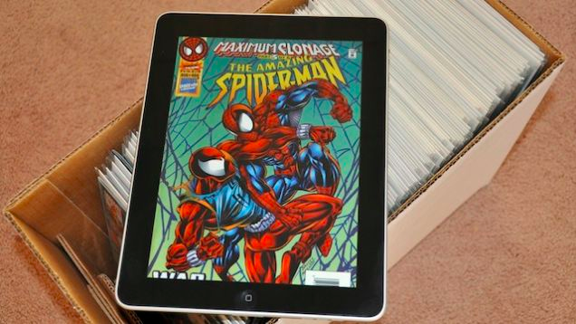
§§§§§§§§§§§§§§§§§§§§§§§§§§§§§§§§§§§§§§§§§§§§§
<!-- .slide: data-background-image="img/xcd.png" -->
§§§§§§§§§§§§§§§§§§§§§§§§§§§§§§§§§§§§§§§§§§§§§
<!-- .slide: data-background-image="img/dessinebande.png" -->
§§§§§§§§§§§§§§§§§§§§§§§§§§§§§§§§§§§§§§§§§§§§§
<!-- .slide: data-background-image="img/bulle.jpg" -->
# Éléments de la BD

- Image
- Texte
- Planche
- Bande / strip
- Vignette ou case
- Bulle ou phylactère
- Cartouche ou commentaire
§§§§§§§§§§§§§§§§§§§§§§§§§§§§§§§§§§§§§§§§§§§§§

<table style="width:100%">
  <tr>
    <th></th>
    <th>Autonomie récit/tableau</th>
    <th>Dépendance récit/tableau</th>
  </tr>
  <tr>
    <td><b>Dominance du récit</b></td>
    <td>Utilisation conventionnelle</td>
    <td>Utilisation rhétorique</td>
  </tr>
  <tr>
    <td><b>Dominance du tableau</b></td>
    <td>Utilisation décorative</td>
    <td>Utilisation productrice</td>
  </tr>
</table>
%%%%%%%%%%%%%%%%%%%%%%%%%%%%%%%%%%%%%%%%%%%%%
<!-- .slide: data-background-image="img/herge.jpg" -->
<!-- .element: class="givemeabackground" -->
# Hergé

 - 22 mai 1907 - 3 mars 1983
 - Dessinateur amateur dans une revue scoute
 - Dessinateur au quotidien _Le Vingtième Siècle_
 - _Aventures de Tintin_, 10 janvier 1929, _Le Petit Vingtième_
 - Ligne claire
 - Du noirs et blanc à la couleur, 1941
 - Studio Hergé

§§§§§§§§§§§§§§§§§§§§§§§§§§§§§§§§§§§§§§§§§§§§§
<!-- .slide: data-background-image="img/tintinA.jpg" -->
<!-- .element: class="givemeabackground" -->
# Tintin en Amérique

 - En noir et blanc du 3 septembre 1931 au 20 octobre 1932 dans les pages du _Petit Vingtième_
 - L'album est publié pour la première fois en 1932
 - La version couleur et actuelle de l'album est parue en 1946
 - Querelle raciste, 2015

§§§§§§§§§§§§§§§§§§§§§§§§§§§§§§§§§§§§§§§§§§§§§

§§§§§§§§§§§§§§§§§§§§§§§§§§§§§§§§§§§§§§§§§§§§§
# Construction du décor - Imaginaire de l'Amérique
§§§§§§§§§§§§§§§§§§§§§§§§§§§§§§§§§§§§§§§§§§§§§

§§§§§§§§§§§§§§§§§§§§§§§§§§§§§§§§§§§§§§§§§§§§§

§§§§§§§§§§§§§§§§§§§§§§§§§§§§§§§§§§§§§§§§§§§§§

§§§§§§§§§§§§§§§§§§§§§§§§§§§§§§§§§§§§§§§§§§§§§

§§§§§§§§§§§§§§§§§§§§§§§§§§§§§§§§§§§§§§§§§§§§§

§§§§§§§§§§§§§§§§§§§§§§§§§§§§§§§§§§§§§§§§§§§§§

§§§§§§§§§§§§§§§§§§§§§§§§§§§§§§§§§§§§§§§§§§§§§

§§§§§§§§§§§§§§§§§§§§§§§§§§§§§§§§§§§§§§§§§§§§§

§§§§§§§§§§§§§§§§§§§§§§§§§§§§§§§§§§§§§§§§§§§§§
# Personnages
§§§§§§§§§§§§§§§§§§§§§§§§§§§§§§§§§§§§§§§§§§§§§
# Tintin
§§§§§§§§§§§§§§§§§§§§§§§§§§§§§§§§§§§§§§§§§§§§§

§§§§§§§§§§§§§§§§§§§§§§§§§§§§§§§§§§§§§§§§§§§§§

§§§§§§§§§§§§§§§§§§§§§§§§§§§§§§§§§§§§§§§§§§§§§

§§§§§§§§§§§§§§§§§§§§§§§§§§§§§§§§§§§§§§§§§§§§§
# Ruse de Tintin
§§§§§§§§§§§§§§§§§§§§§§§§§§§§§§§§§§§§§§§§§§§§§

§§§§§§§§§§§§§§§§§§§§§§§§§§§§§§§§§§§§§§§§§§§§§
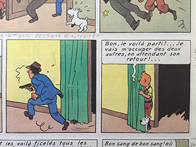
§§§§§§§§§§§§§§§§§§§§§§§§§§§§§§§§§§§§§§§§§§§§§
# Chance de Tintin
§§§§§§§§§§§§§§§§§§§§§§§§§§§§§§§§§§§§§§§§§§§§§

§§§§§§§§§§§§§§§§§§§§§§§§§§§§§§§§§§§§§§§§§§§§§
#### Al Capone

§§§§§§§§§§§§§§§§§§§§§§§§§§§§§§§§§§§§§§§§§§§§§
#### Bobby Smiles

§§§§§§§§§§§§§§§§§§§§§§§§§§§§§§§§§§§§§§§§§§§§§
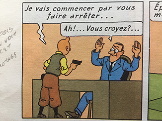
§§§§§§§§§§§§§§§§§§§§§§§§§§§§§§§§§§§§§§§§§§§§§
#### Gangsters

§§§§§§§§§§§§§§§§§§§§§§§§§§§§§§§§§§§§§§§§§§§§§

§§§§§§§§§§§§§§§§§§§§§§§§§§§§§§§§§§§§§§§§§§§§§
#### Police américaine
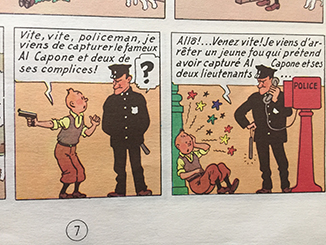
§§§§§§§§§§§§§§§§§§§§§§§§§§§§§§§§§§§§§§§§§§§§§
#### Indiens d'Amérique

§§§§§§§§§§§§§§§§§§§§§§§§§§§§§§§§§§§§§§§§§§§§§

§§§§§§§§§§§§§§§§§§§§§§§§§§§§§§§§§§§§§§§§§§§§§
#### Mike Mac Adam

§§§§§§§§§§§§§§§§§§§§§§§§§§§§§§§§§§§§§§§§§§§§§

§§§§§§§§§§§§§§§§§§§§§§§§§§§§§§§§§§§§§§§§§§§§§
# Humour
§§§§§§§§§§§§§§§§§§§§§§§§§§§§§§§§§§§§§§§§§§§§§
#### Appel à l'imaginaire du lecteur

§§§§§§§§§§§§§§§§§§§§§§§§§§§§§§§§§§§§§§§§§§§§§

§§§§§§§§§§§§§§§§§§§§§§§§§§§§§§§§§§§§§§§§§§§§§

§§§§§§§§§§§§§§§§§§§§§§§§§§§§§§§§§§§§§§§§§§§§§
#### Répétitions

§§§§§§§§§§§§§§§§§§§§§§§§§§§§§§§§§§§§§§§§§§§§§

§§§§§§§§§§§§§§§§§§§§§§§§§§§§§§§§§§§§§§§§§§§§§

§§§§§§§§§§§§§§§§§§§§§§§§§§§§§§§§§§§§§§§§§§§§§
# Techniques narratives
§§§§§§§§§§§§§§§§§§§§§§§§§§§§§§§§§§§§§§§§§§§§§
##### Enchaînement en séquence

§§§§§§§§§§§§§§§§§§§§§§§§§§§§§§§§§§§§§§§§§§§§§
##### Anticipations

§§§§§§§§§§§§§§§§§§§§§§§§§§§§§§§§§§§§§§§§§§§§§
##### Suspense de bas de page

§§§§§§§§§§§§§§§§§§§§§§§§§§§§§§§§§§§§§§§§§§§§§

§§§§§§§§§§§§§§§§§§§§§§§§§§§§§§§§§§§§§§§§§§§§§

§§§§§§§§§§§§§§§§§§§§§§§§§§§§§§§§§§§§§§§§§§§§§

§§§§§§§§§§§§§§§§§§§§§§§§§§§§§§§§§§§§§§§§§§§§§

§§§§§§§§§§§§§§§§§§§§§§§§§§§§§§§§§§§§§§§§§§§§§

§§§§§§§§§§§§§§§§§§§§§§§§§§§§§§§§§§§§§§§§§§§§§
##### Tension narrative

§§§§§§§§§§§§§§§§§§§§§§§§§§§§§§§§§§§§§§§§§§§§§
##### Récapitulations

§§§§§§§§§§§§§§§§§§§§§§§§§§§§§§§§§§§§§§§§§§§§§
##### Explications

§§§§§§§§§§§§§§§§§§§§§§§§§§§§§§§§§§§§§§§§§§§§§

§§§§§§§§§§§§§§§§§§§§§§§§§§§§§§§§§§§§§§§§§§§§§

§§§§§§§§§§§§§§§§§§§§§§§§§§§§§§§§§§§§§§§§§§§§§

§§§§§§§§§§§§§§§§§§§§§§§§§§§§§§§§§§§§§§§§§§§§§
##### Case et récit

§§§§§§§§§§§§§§§§§§§§§§§§§§§§§§§§§§§§§§§§§§§§§

%%%%%%%%%%%%%%%%%%%%%%%%%%%%%%%%%%%%%%%%%%%%%
<!-- .slide: data-background-image="img/uderzoGoscinny.jpg" -->
<!-- .element: class="givemeabackground" -->
# Goscinny et Uderzo
§§§§§§§§§§§§§§§§§§§§§§§§§§§§§§§§§§§§§§§§§§§§§
# Albert Uderzo, 25 avril 1927

- Déssinateur jeunesse
- Grande presse et illustrations
- Création d'un syndicat d'artistes : les dessinateurs sont les proprietaires des œuvres
- _Journal de Tintin_
- Magazine _Pilote_ : première série d'_Astérix_
- 1977, mort de Goscinny
- 2013, retraite
§§§§§§§§§§§§§§§§§§§§§§§§§§§§§§§§§§§§§§§§§§§§§
# René Goscinny, 11 août 1926- 5 novembre 1977

- Enfance en Argentine
- Premiers travaux à New York
- 1951, travaille à Paris pour _World Press_
- Reconnaissance du métier de scénariste de BD
§§§§§§§§§§§§§§§§§§§§§§§§§§§§§§§§§§§§§§§§§§§§§
<!-- .slide: data-background-image="img/asterixObelix.jpg" -->
<!-- .element: class="givemeabackground" -->
# Astérix et Obelix

- 50 av. J.-C.
 - Aventure d'un village gaulois qui résiste à la conquête romaine de la Gaule
 - Prisme pour le folklore et la société français.e.s
 - Comique de répétition
 - Ligne sombre

§§§§§§§§§§§§§§§§§§§§§§§§§§§§§§§§§§§§§§§§§§§§§
<!-- .slide: data-background-image="img/chaudron.jpg" -->
<!-- .element: class="givemeabackground" -->
# Astérix et le chaudron

 - Publié dans _Pilote_ du 31 octobre 1968 au 3 avril 1969
 - Publié en album en 1969
 - Insipiré par les problèmes d'impôts des auteurs

§§§§§§§§§§§§§§§§§§§§§§§§§§§§§§§§§§§§§§§§§§§§§
# Paratexte introductif
§§§§§§§§§§§§§§§§§§§§§§§§§§§§§§§§§§§§§§§§§§§§§

§§§§§§§§§§§§§§§§§§§§§§§§§§§§§§§§§§§§§§§§§§§§§
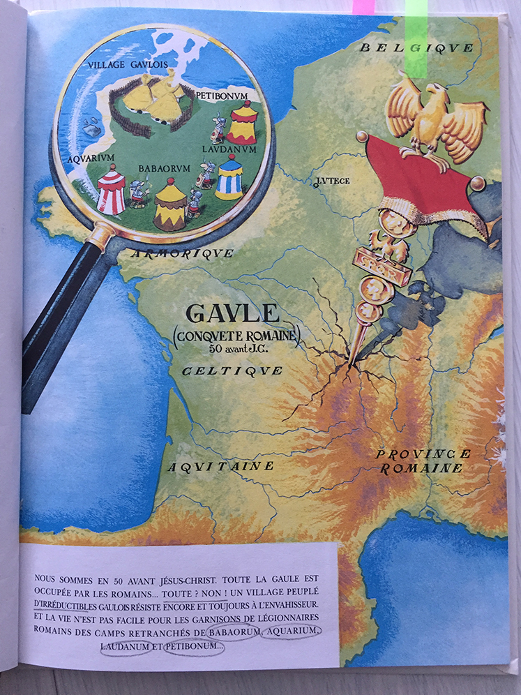
§§§§§§§§§§§§§§§§§§§§§§§§§§§§§§§§§§§§§§§§§§§§§

§§§§§§§§§§§§§§§§§§§§§§§§§§§§§§§§§§§§§§§§§§§§§

§§§§§§§§§§§§§§§§§§§§§§§§§§§§§§§§§§§§§§§§§§§§§
# Construction du décor
§§§§§§§§§§§§§§§§§§§§§§§§§§§§§§§§§§§§§§§§§§§§§

§§§§§§§§§§§§§§§§§§§§§§§§§§§§§§§§§§§§§§§§§§§§§
# Personnages
§§§§§§§§§§§§§§§§§§§§§§§§§§§§§§§§§§§§§§§§§§§§§
# Moralelastix

§§§§§§§§§§§§§§§§§§§§§§§§§§§§§§§§§§§§§§§§§§§§§

§§§§§§§§§§§§§§§§§§§§§§§§§§§§§§§§§§§§§§§§§§§§§

§§§§§§§§§§§§§§§§§§§§§§§§§§§§§§§§§§§§§§§§§§§§§
# Obélix

§§§§§§§§§§§§§§§§§§§§§§§§§§§§§§§§§§§§§§§§§§§§§

§§§§§§§§§§§§§§§§§§§§§§§§§§§§§§§§§§§§§§§§§§§§§
# Pirates

§§§§§§§§§§§§§§§§§§§§§§§§§§§§§§§§§§§§§§§§§§§§§

§§§§§§§§§§§§§§§§§§§§§§§§§§§§§§§§§§§§§§§§§§§§§
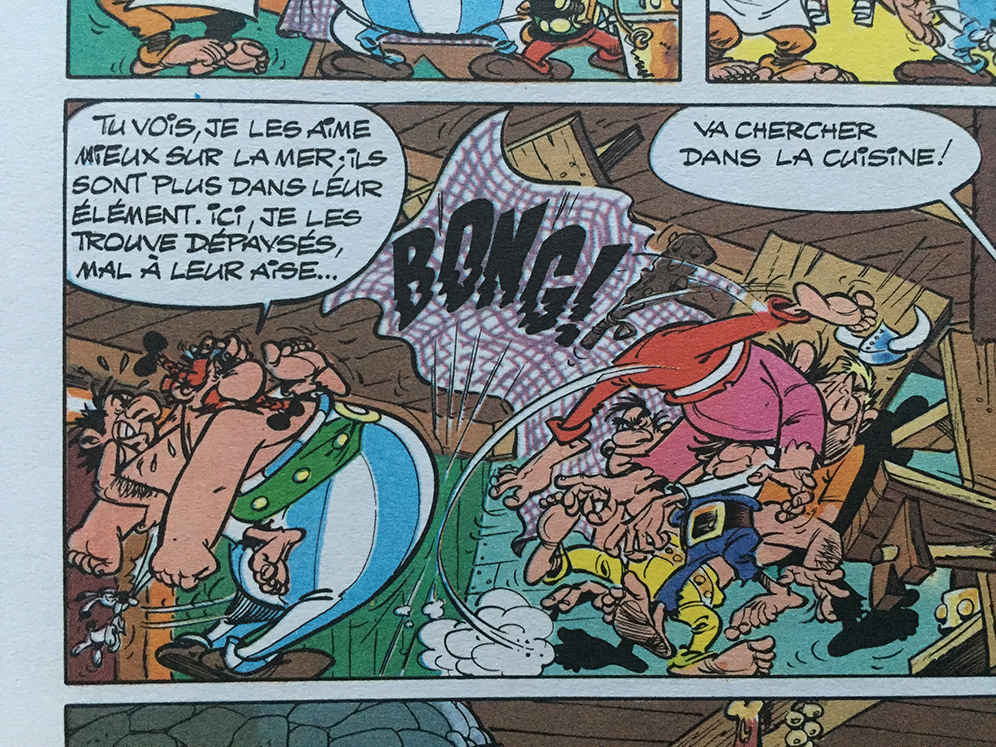
§§§§§§§§§§§§§§§§§§§§§§§§§§§§§§§§§§§§§§§§§§§§§
# Éléonoradus

§§§§§§§§§§§§§§§§§§§§§§§§§§§§§§§§§§§§§§§§§§§§§
# Humour
§§§§§§§§§§§§§§§§§§§§§§§§§§§§§§§§§§§§§§§§§§§§§
# Répétitions dans la série
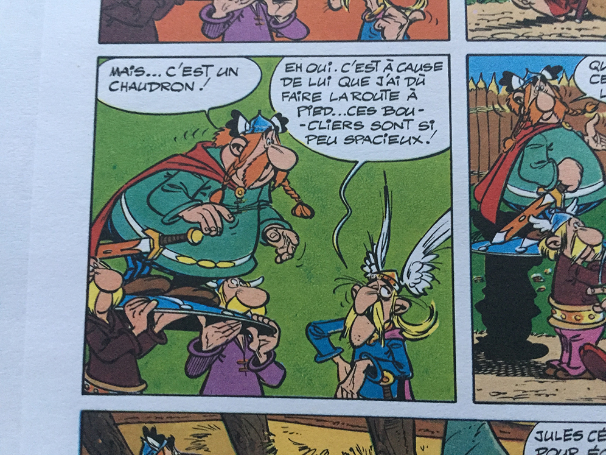
§§§§§§§§§§§§§§§§§§§§§§§§§§§§§§§§§§§§§§§§§§§§§
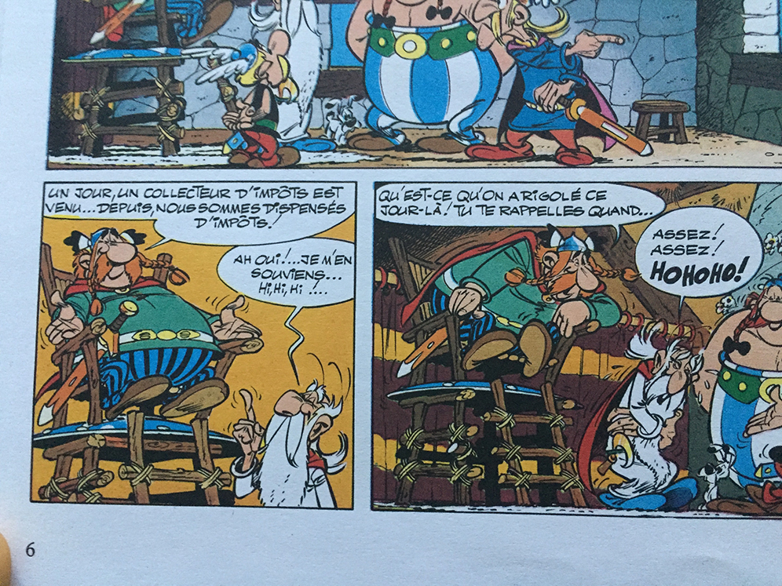
§§§§§§§§§§§§§§§§§§§§§§§§§§§§§§§§§§§§§§§§§§§§§

§§§§§§§§§§§§§§§§§§§§§§§§§§§§§§§§§§§§§§§§§§§§§

§§§§§§§§§§§§§§§§§§§§§§§§§§§§§§§§§§§§§§§§§§§§§

§§§§§§§§§§§§§§§§§§§§§§§§§§§§§§§§§§§§§§§§§§§§§

§§§§§§§§§§§§§§§§§§§§§§§§§§§§§§§§§§§§§§§§§§§§§

§§§§§§§§§§§§§§§§§§§§§§§§§§§§§§§§§§§§§§§§§§§§§
### Répétitions dans l'album - Running gag

§§§§§§§§§§§§§§§§§§§§§§§§§§§§§§§§§§§§§§§§§§§§§

§§§§§§§§§§§§§§§§§§§§§§§§§§§§§§§§§§§§§§§§§§§§§

§§§§§§§§§§§§§§§§§§§§§§§§§§§§§§§§§§§§§§§§§§§§§

§§§§§§§§§§§§§§§§§§§§§§§§§§§§§§§§§§§§§§§§§§§§§
### Jeux de mots
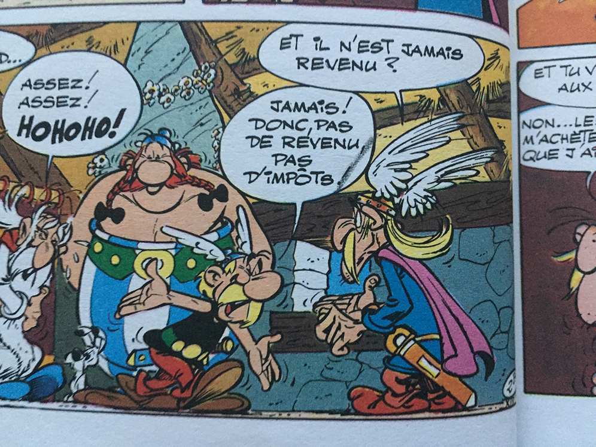
§§§§§§§§§§§§§§§§§§§§§§§§§§§§§§§§§§§§§§§§§§§§§

§§§§§§§§§§§§§§§§§§§§§§§§§§§§§§§§§§§§§§§§§§§§§
### Appel aux connaissances du lecteur

§§§§§§§§§§§§§§§§§§§§§§§§§§§§§§§§§§§§§§§§§§§§§

§§§§§§§§§§§§§§§§§§§§§§§§§§§§§§§§§§§§§§§§§§§§§

§§§§§§§§§§§§§§§§§§§§§§§§§§§§§§§§§§§§§§§§§§§§§
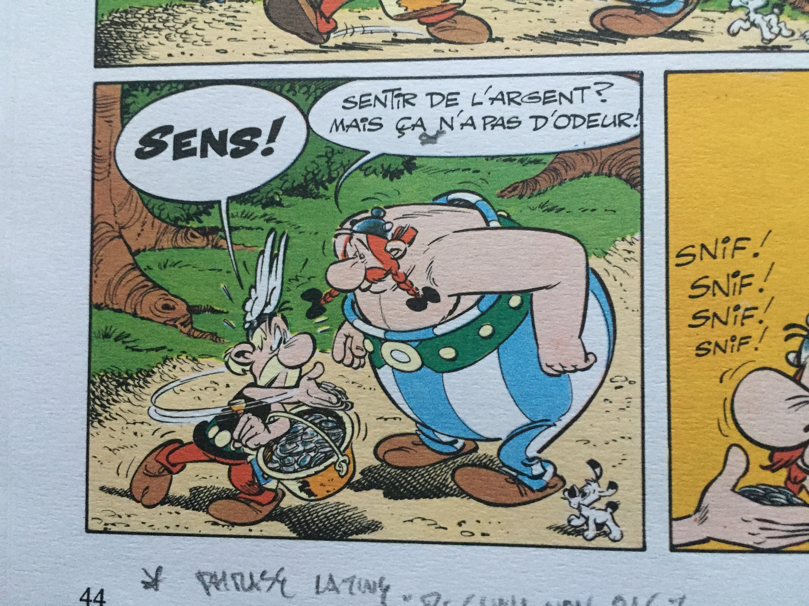
§§§§§§§§§§§§§§§§§§§§§§§§§§§§§§§§§§§§§§§§§§§§§
### Métadiscours

§§§§§§§§§§§§§§§§§§§§§§§§§§§§§§§§§§§§§§§§§§§§§

§§§§§§§§§§§§§§§§§§§§§§§§§§§§§§§§§§§§§§§§§§§§§
### Humour visuel

§§§§§§§§§§§§§§§§§§§§§§§§§§§§§§§§§§§§§§§§§§§§§

§§§§§§§§§§§§§§§§§§§§§§§§§§§§§§§§§§§§§§§§§§§§§

§§§§§§§§§§§§§§§§§§§§§§§§§§§§§§§§§§§§§§§§§§§§§

§§§§§§§§§§§§§§§§§§§§§§§§§§§§§§§§§§§§§§§§§§§§§

§§§§§§§§§§§§§§§§§§§§§§§§§§§§§§§§§§§§§§§§§§§§§

§§§§§§§§§§§§§§§§§§§§§§§§§§§§§§§§§§§§§§§§§§§§§
#### Dévoilement

§§§§§§§§§§§§§§§§§§§§§§§§§§§§§§§§§§§§§§§§§§§§§
#### Planche finale

%%%%%%%%%%%%%%%%%%%%%%%%%%%%%%%%%%%%%%%%%%%%%
<!-- .slide: data-background-image="img/rabagliati.jpg" -->
<!-- .element: class="givemeabackground" -->
#### Michel Rabagliati, 28 février 1961

- Travaille dans l'illustration
 - Publie dans des fanzines québécois
 - 1998, création du personnage _Paul_, short stories dans _Spoutnik_
 - 1999 publication chez _La pastèque_

§§§§§§§§§§§§§§§§§§§§§§§§§§§§§§§§§§§§§§§§§§§§§
<!-- .slide: data-background-image="img/Paul.jpg" -->
<!-- .element: class="givemeabackground" -->
### Paul

- Alter égo de l'auteur
 - Bande dessinée d'auto-fiction
 - Identité montréalaise et québécoise
 - Inspiration de la ligne claire

§§§§§§§§§§§§§§§§§§§§§§§§§§§§§§§§§§§§§§§§§§§§§
<!-- .slide: data-background-image="img/zazie.jpg" -->
<!-- .element: class="givemeabackground" -->
### Paul dans le métro

- 2005, _La Pastèque_
 - Recueil d'histoires courtes, cas unique dans la série
 - Histoire principale qui donne le nom au volume

§§§§§§§§§§§§§§§§§§§§§§§§§§§§§§§§§§§§§§§§§§§§§
### Contexte

§§§§§§§§§§§§§§§§§§§§§§§§§§§§§§§§§§§§§§§§§§§§§

§§§§§§§§§§§§§§§§§§§§§§§§§§§§§§§§§§§§§§§§§§§§§

§§§§§§§§§§§§§§§§§§§§§§§§§§§§§§§§§§§§§§§§§§§§§

§§§§§§§§§§§§§§§§§§§§§§§§§§§§§§§§§§§§§§§§§§§§§
### Personnages
§§§§§§§§§§§§§§§§§§§§§§§§§§§§§§§§§§§§§§§§§§§§§

§§§§§§§§§§§§§§§§§§§§§§§§§§§§§§§§§§§§§§§§§§§§§

§§§§§§§§§§§§§§§§§§§§§§§§§§§§§§§§§§§§§§§§§§§§§

§§§§§§§§§§§§§§§§§§§§§§§§§§§§§§§§§§§§§§§§§§§§§

§§§§§§§§§§§§§§§§§§§§§§§§§§§§§§§§§§§§§§§§§§§§§
### Clichés

§§§§§§§§§§§§§§§§§§§§§§§§§§§§§§§§§§§§§§§§§§§§§

§§§§§§§§§§§§§§§§§§§§§§§§§§§§§§§§§§§§§§§§§§§§§
### Technique
§§§§§§§§§§§§§§§§§§§§§§§§§§§§§§§§§§§§§§§§§§§§§

§§§§§§§§§§§§§§§§§§§§§§§§§§§§§§§§§§§§§§§§§§§§§

§§§§§§§§§§§§§§§§§§§§§§§§§§§§§§§§§§§§§§§§§§§§§

§§§§§§§§§§§§§§§§§§§§§§§§§§§§§§§§§§§§§§§§§§§§§

§§§§§§§§§§§§§§§§§§§§§§§§§§§§§§§§§§§§§§§§§§§§§
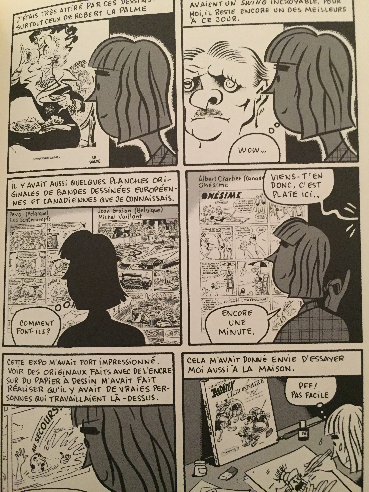
§§§§§§§§§§§§§§§§§§§§§§§§§§§§§§§§§§§§§§§§§§§§§
### Répétitions

§§§§§§§§§§§§§§§§§§§§§§§§§§§§§§§§§§§§§§§§§§§§§

§§§§§§§§§§§§§§§§§§§§§§§§§§§§§§§§§§§§§§§§§§§§§
### Ellipses

§§§§§§§§§§§§§§§§§§§§§§§§§§§§§§§§§§§§§§§§§§§§§
### Case et scénario
§§§§§§§§§§§§§§§§§§§§§§§§§§§§§§§§§§§§§§§§§§§§§

§§§§§§§§§§§§§§§§§§§§§§§§§§§§§§§§§§§§§§§§§§§§§

§§§§§§§§§§§§§§§§§§§§§§§§§§§§§§§§§§§§§§§§§§§§§
### Présentation et cliché

§§§§§§§§§§§§§§§§§§§§§§§§§§§§§§§§§§§§§§§§§§§§§

§§§§§§§§§§§§§§§§§§§§§§§§§§§§§§§§§§§§§§§§§§§§§
### Technique

§§§§§§§§§§§§§§§§§§§§§§§§§§§§§§§§§§§§§§§§§§§§§
### Intertextualité

§§§§§§§§§§§§§§§§§§§§§§§§§§§§§§§§§§§§§§§§§§§§§
### Technique

§§§§§§§§§§§§§§§§§§§§§§§§§§§§§§§§§§§§§§§§§§§§§
### Ironie finale - Morale
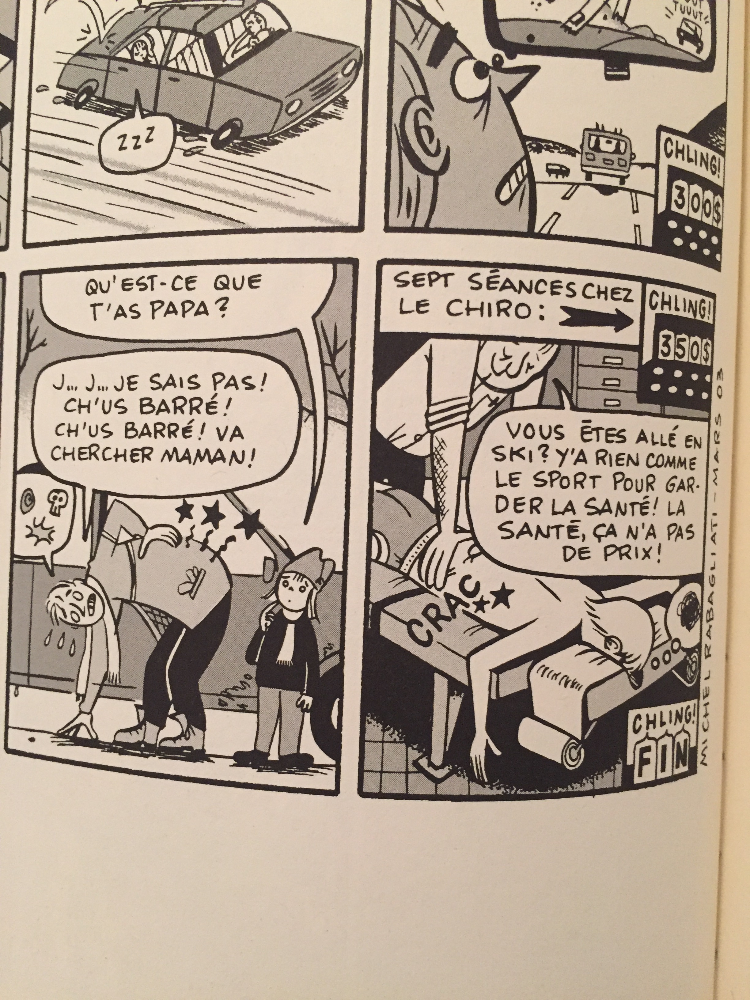
§§§§§§§§§§§§§§§§§§§§§§§§§§§§§§§§§§§§§§§§§§§§§
### Personnages

§§§§§§§§§§§§§§§§§§§§§§§§§§§§§§§§§§§§§§§§§§§§§

§§§§§§§§§§§§§§§§§§§§§§§§§§§§§§§§§§§§§§§§§§§§§
##### Cliché

§§§§§§§§§§§§§§§§§§§§§§§§§§§§§§§§§§§§§§§§§§§§§

§§§§§§§§§§§§§§§§§§§§§§§§§§§§§§§§§§§§§§§§§§§§§

§§§§§§§§§§§§§§§§§§§§§§§§§§§§§§§§§§§§§§§§§§§§§
# Men in black

Récit humoristique sur sa maison d'édition

Absence de dialogue, mais le texte ?
§§§§§§§§§§§§§§§§§§§§§§§§§§§§§§§§§§§§§§§§§§§§§
### Bloopers

Jeu sur les codes du cinéma et sur le montage

Rapports entre Cinéma et BD : cadrage, montage vs découpage
§§§§§§§§§§§§§§§§§§§§§§§§§§§§§§§§§§§§§§§§§§§§§
#### Métadiscours

§§§§§§§§§§§§§§§§§§§§§§§§§§§§§§§§§§§§§§§§§§§§§
#### Ironie de l'intratextualité

%%%%%%%%%%%%%%%%%%%%%%%%%%%%%%%%%%%%%%%%%%%%%
<!-- .slide: data-background-image="img/alexLevesque.jpg" -->
<!-- .element: class="givemeabackground" -->
### Alexandre Lévesque

- Monteur et Caméraman chez Radio-Canada
 - Travaille dans une station de ski à Baie-Comeau
 - Fan du webcomic

§§§§§§§§§§§§§§§§§§§§§§§§§§§§§§§§§§§§§§§§§§§§§
<!-- .slide: data-background-image="img/db.jpg" -->
<!-- .element: class="givemeabackground" -->

- Expérience de BD sur son profil et sur Tumblr
 - Contrainte d'écriture : un dessin chaque jour
 - Humour noir, jeux de mots, humour satirique
 - Caricature
 - Strip ou case

§§§§§§§§§§§§§§§§§§§§§§§§§§§§§§§§§§§§§§§§§§§§§
#### Cyanide and Happiness

§§§§§§§§§§§§§§§§§§§§§§§§§§§§§§§§§§§§§§§§§§§§§
#### Joan Cornellà

§§§§§§§§§§§§§§§§§§§§§§§§§§§§§§§§§§§§§§§§§§§§§
##### Métadiscours sur les techniques de la BD

§§§§§§§§§§§§§§§§§§§§§§§§§§§§§§§§§§§§§§§§§§§§§

§§§§§§§§§§§§§§§§§§§§§§§§§§§§§§§§§§§§§§§§§§§§§

§§§§§§§§§§§§§§§§§§§§§§§§§§§§§§§§§§§§§§§§§§§§§

§§§§§§§§§§§§§§§§§§§§§§§§§§§§§§§§§§§§§§§§§§§§§

§§§§§§§§§§§§§§§§§§§§§§§§§§§§§§§§§§§§§§§§§§§§§

§§§§§§§§§§§§§§§§§§§§§§§§§§§§§§§§§§§§§§§§§§§§§

§§§§§§§§§§§§§§§§§§§§§§§§§§§§§§§§§§§§§§§§§§§§§

§§§§§§§§§§§§§§§§§§§§§§§§§§§§§§§§§§§§§§§§§§§§§

§§§§§§§§§§§§§§§§§§§§§§§§§§§§§§§§§§§§§§§§§§§§§
#### Métadiscours sur sa propre technique

§§§§§§§§§§§§§§§§§§§§§§§§§§§§§§§§§§§§§§§§§§§§§

Peut-être le seule personnage
§§§§§§§§§§§§§§§§§§§§§§§§§§§§§§§§§§§§§§§§§§§§§

§§§§§§§§§§§§§§§§§§§§§§§§§§§§§§§§§§§§§§§§§§§§§

§§§§§§§§§§§§§§§§§§§§§§§§§§§§§§§§§§§§§§§§§§§§§
#### Jeux de mots

§§§§§§§§§§§§§§§§§§§§§§§§§§§§§§§§§§§§§§§§§§§§§

§§§§§§§§§§§§§§§§§§§§§§§§§§§§§§§§§§§§§§§§§§§§§

§§§§§§§§§§§§§§§§§§§§§§§§§§§§§§§§§§§§§§§§§§§§§

§§§§§§§§§§§§§§§§§§§§§§§§§§§§§§§§§§§§§§§§§§§§§

§§§§§§§§§§§§§§§§§§§§§§§§§§§§§§§§§§§§§§§§§§§§§

§§§§§§§§§§§§§§§§§§§§§§§§§§§§§§§§§§§§§§§§§§§§§

§§§§§§§§§§§§§§§§§§§§§§§§§§§§§§§§§§§§§§§§§§§§§
#### Jeux de mots anglais/français

§§§§§§§§§§§§§§§§§§§§§§§§§§§§§§§§§§§§§§§§§§§§§

§§§§§§§§§§§§§§§§§§§§§§§§§§§§§§§§§§§§§§§§§§§§§

§§§§§§§§§§§§§§§§§§§§§§§§§§§§§§§§§§§§§§§§§§§§§
#### Imaginaire du lecteur

§§§§§§§§§§§§§§§§§§§§§§§§§§§§§§§§§§§§§§§§§§§§§

§§§§§§§§§§§§§§§§§§§§§§§§§§§§§§§§§§§§§§§§§§§§§

§§§§§§§§§§§§§§§§§§§§§§§§§§§§§§§§§§§§§§§§§§§§§

§§§§§§§§§§§§§§§§§§§§§§§§§§§§§§§§§§§§§§§§§§§§§

§§§§§§§§§§§§§§§§§§§§§§§§§§§§§§§§§§§§§§§§§§§§§
#### Humour contextuel

§§§§§§§§§§§§§§§§§§§§§§§§§§§§§§§§§§§§§§§§§§§§§

§§§§§§§§§§§§§§§§§§§§§§§§§§§§§§§§§§§§§§§§§§§§§
#### Case et récit
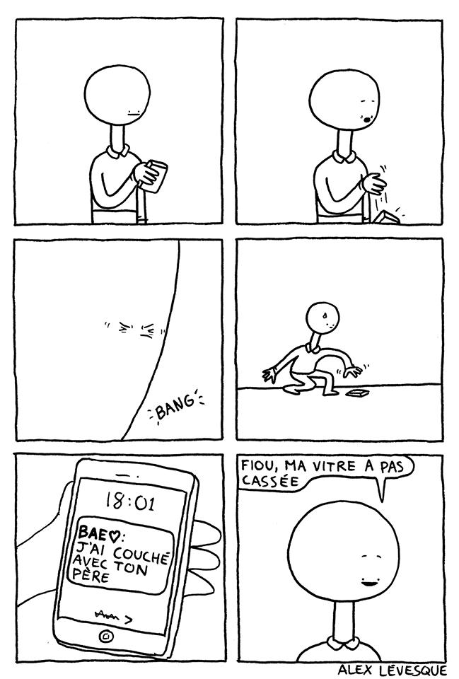
§§§§§§§§§§§§§§§§§§§§§§§§§§§§§§§§§§§§§§§§§§§§§

§§§§§§§§§§§§§§§§§§§§§§§§§§§§§§§§§§§§§§§§§§§§§

§§§§§§§§§§§§§§§§§§§§§§§§§§§§§§§§§§§§§§§§§§§§§

§§§§§§§§§§§§§§§§§§§§§§§§§§§§§§§§§§§§§§§§§§§§§

§§§§§§§§§§§§§§§§§§§§§§§§§§§§§§§§§§§§§§§§§§§§§
### Blooper

§§§§§§§§§§§§§§§§§§§§§§§§§§§§§§§§§§§§§§§§§§§§§
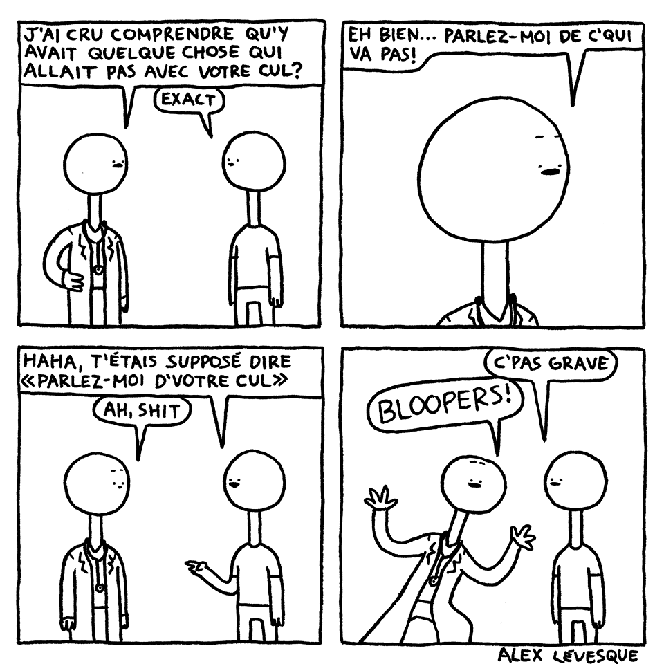
%%%%%%%%%%%%%%%%%%%%%%%%%%%%%%%%%%%%%%%%%%%%%
<!-- .slide: data-background-image="img/ren.jpg" -->
<!-- .element: class="givemeabackground" -->
### Marietta Ren

 - Illustrations et expositions
 - Artiste
 - Industrie de l'animation
 - Environments transmédia

§§§§§§§§§§§§§§§§§§§§§§§§§§§§§§§§§§§§§§§§§§§§§
<!-- .slide: data-background-image="img/phallaina.jpg" -->
<!-- .element: class="givemeabackground" -->
### Phallaina

 - Science, fiction et mythologie
 - « Bande défilée »
 - Scrolling horizontal
 - Accompagnement sonore
 - 1600 écrans de tablette
 - Nativement numérique
 - Installation physique

§§§§§§§§§§§§§§§§§§§§§§§§§§§§§§§§§§§§§§§§§§§§§
#### Effets de transition - enchaînement des séquences

§§§§§§§§§§§§§§§§§§§§§§§§§§§§§§§§§§§§§§§§§§§§§

§§§§§§§§§§§§§§§§§§§§§§§§§§§§§§§§§§§§§§§§§§§§§

§§§§§§§§§§§§§§§§§§§§§§§§§§§§§§§§§§§§§§§§§§§§§

§§§§§§§§§§§§§§§§§§§§§§§§§§§§§§§§§§§§§§§§§§§§§

§§§§§§§§§§§§§§§§§§§§§§§§§§§§§§§§§§§§§§§§§§§§§
#### Effets graphiques - enchaînement des séquences

§§§§§§§§§§§§§§§§§§§§§§§§§§§§§§§§§§§§§§§§§§§§§

§§§§§§§§§§§§§§§§§§§§§§§§§§§§§§§§§§§§§§§§§§§§§

§§§§§§§§§§§§§§§§§§§§§§§§§§§§§§§§§§§§§§§§§§§§§
#### Doublements sémiotiques

§§§§§§§§§§§§§§§§§§§§§§§§§§§§§§§§§§§§§§§§§§§§§

§§§§§§§§§§§§§§§§§§§§§§§§§§§§§§§§§§§§§§§§§§§§§

§§§§§§§§§§§§§§§§§§§§§§§§§§§§§§§§§§§§§§§§§§§§§
#### Imaginaire du lecteur - science fiction

§§§§§§§§§§§§§§§§§§§§§§§§§§§§§§§§§§§§§§§§§§§§§

§§§§§§§§§§§§§§§§§§§§§§§§§§§§§§§§§§§§§§§§§§§§§

§§§§§§§§§§§§§§§§§§§§§§§§§§§§§§§§§§§§§§§§§§§§§

§§§§§§§§§§§§§§§§§§§§§§§§§§§§§§§§§§§§§§§§§§§§§

§§§§§§§§§§§§§§§§§§§§§§§§§§§§§§§§§§§§§§§§§§§§§

§§§§§§§§§§§§§§§§§§§§§§§§§§§§§§§§§§§§§§§§§§§§§

§§§§§§§§§§§§§§§§§§§§§§§§§§§§§§§§§§§§§§§§§§§§§

§§§§§§§§§§§§§§§§§§§§§§§§§§§§§§§§§§§§§§§§§§§§§
#### Imaginaire du lecteur - mythologie

§§§§§§§§§§§§§§§§§§§§§§§§§§§§§§§§§§§§§§§§§§§§§

§§§§§§§§§§§§§§§§§§§§§§§§§§§§§§§§§§§§§§§§§§§§§

§§§§§§§§§§§§§§§§§§§§§§§§§§§§§§§§§§§§§§§§§§§§§
#### Techniques graphiques

§§§§§§§§§§§§§§§§§§§§§§§§§§§§§§§§§§§§§§§§§§§§§

§§§§§§§§§§§§§§§§§§§§§§§§§§§§§§§§§§§§§§§§§§§§§

§§§§§§§§§§§§§§§§§§§§§§§§§§§§§§§§§§§§§§§§§§§§§

§§§§§§§§§§§§§§§§§§§§§§§§§§§§§§§§§§§§§§§§§§§§§

§§§§§§§§§§§§§§§§§§§§§§§§§§§§§§§§§§§§§§§§§§§§§

§§§§§§§§§§§§§§§§§§§§§§§§§§§§§§§§§§§§§§§§§§§§§
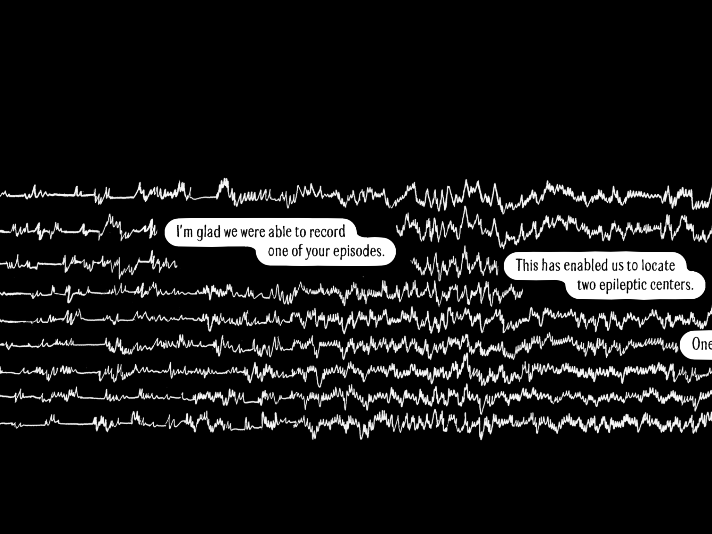
§§§§§§§§§§§§§§§§§§§§§§§§§§§§§§§§§§§§§§§§§§§§§

§§§§§§§§§§§§§§§§§§§§§§§§§§§§§§§§§§§§§§§§§§§§§

§§§§§§§§§§§§§§§§§§§§§§§§§§§§§§§§§§§§§§§§§§§§§

§§§§§§§§§§§§§§§§§§§§§§§§§§§§§§§§§§§§§§§§§§§§§
#### Répétitions

§§§§§§§§§§§§§§§§§§§§§§§§§§§§§§§§§§§§§§§§§§§§§

§§§§§§§§§§§§§§§§§§§§§§§§§§§§§§§§§§§§§§§§§§§§§

§§§§§§§§§§§§§§§§§§§§§§§§§§§§§§§§§§§§§§§§§§§§§
#### Case et scénario

§§§§§§§§§§§§§§§§§§§§§§§§§§§§§§§§§§§§§§§§§§§§§

§§§§§§§§§§§§§§§§§§§§§§§§§§§§§§§§§§§§§§§§§§§§§

§§§§§§§§§§§§§§§§§§§§§§§§§§§§§§§§§§§§§§§§§§§§§

§§§§§§§§§§§§§§§§§§§§§§§§§§§§§§§§§§§§§§§§§§§§§

§§§§§§§§§§§§§§§§§§§§§§§§§§§§§§§§§§§§§§§§§§§§§

§§§§§§§§§§§§§§§§§§§§§§§§§§§§§§§§§§§§§§§§§§§§§
#### Musique et récit

§§§§§§§§§§§§§§§§§§§§§§§§§§§§§§§§§§§§§§§§§§§§§

§§§§§§§§§§§§§§§§§§§§§§§§§§§§§§§§§§§§§§§§§§§§§

§§§§§§§§§§§§§§§§§§§§§§§§§§§§§§§§§§§§§§§§§§§§§

§§§§§§§§§§§§§§§§§§§§§§§§§§§§§§§§§§§§§§§§§§§§§
#### Métadiscours

§§§§§§§§§§§§§§§§§§§§§§§§§§§§§§§§§§§§§§§§§§§§§

§§§§§§§§§§§§§§§§§§§§§§§§§§§§§§§§§§§§§§§§§§§§§
#### Explications

§§§§§§§§§§§§§§§§§§§§§§§§§§§§§§§§§§§§§§§§§§§§§
#### Générique

%%%%%%%%%%%%%%%%%%%%%%%%%%%%%%%%%%%%%%%%%%%%%
# 9 février 2018 - Roman policier
§§§§§§§§§§§§§§§§§§§§§§§§§§§§§§§§§§§§§§§§§§§§§
Le genre policier : une question de structure ?
§§§§§§§§§§§§§§§§§§§§§§§§§§§§§§§§§§§§§§§§§§§§§
# Spécificité du policier

- Herméneutique
- Schéma narratif
- Métaphysique du policier

§§§§§§§§§§§§§§§§§§§§§§§§§§§§§§§§§§§§§§§§§§§§§
# Schéma narratif

- Présentation du contexte : lieux, personnages, etc
- Crime qui brise l'ordre et déclenche l'enquête
- Dénouement, explication et retour à la normalité
- Crimes vs enquête
- Règles pour le policier : http://www.romanpolicier.net/les-20-regles-de-van-dine/

§§§§§§§§§§§§§§§§§§§§§§§§§§§§§§§§§§§§§§§§§§§§§
# Métaphysique du policier

- Histoire de conjecture à l’état pur
- Tous les faits ont une logique, la logique que leur a imposée le coupable

« Le dédale de ma bibliothèque est encore un labyrinthe maniériste, mais le monde où Guillaume s’aperçoit qu’il vit est déjà structuré en rhizome : il est structurable mais jamais définitivement structuré »

%%%%%%%%%%%%%%%%%%%%%%%%%%%%%%%%%%%%%%%%%%%%%
# Georges Simenon, 12 février 1903 - 4 septembre 1989

- Production immense
- Plusieurs pseudonymes
- Production littéraire « dure » et production paralittéraire
§§§§§§§§§§§§§§§§§§§§§§§§§§§§§§§§§§§§§§§§§§§§§
# Maigret

- Première apparition dans un feuilleton, _La maison de l'inquiétude_, 1930, pseudonyme Georges Sim
- 75 policiers et 28 nouvelles
- Figure inspirée du Commissaire Marcel Guillaume
- _Les mémoires de Maigret_, roman non policier
- Sensibilité, humanité, bon sens et compassion
%%%%%%%%%%%%%%%%%%%%%%%%%%%%%%%%%%%%%%%%%%%%%
# Fred Vargas - 7 juin 1957

- Nom de plume de Frédérique Audoin-Rouzeau
- Archéozoologue et médiéviste
- Policiers, romans « canoniques », nouvelles, essais
§§§§§§§§§§§§§§§§§§§§§§§§§§§§§§§§§§§§§§§§§§§§§
# Jean-Baptiste Adamberg

- Indifférent, sensible, pas d'analyse et de déduction - absence de méthode d'investigation ?
- Plusieurs détails sur sa vie privée et sur son passé dans les romans
- 9 policiers, 1 bande déssinée, nouvelles
%%%%%%%%%%%%%%%%%%%%%%%%%%%%%%%%%%%%%%%%%%%%%
# Umberto Eco, 5 janvier 1932 - 19 février 2016

- Érudit : philosophie, esthétique, histoire du Moyen Âge, sémiotique, ...
- Une quarantaine de doctorats _honoris causa_
§§§§§§§§§§§§§§§§§§§§§§§§§§§§§§§§§§§§§§§§§§§§§
# Le nom de la rose

- 1980 en italien, 1982 en français
- Policier médiéval (?)
- 1999, _Fnac_ et _Le Monde_ : Les cent livres du siècle

https://www.youtube.com/watch?v=d71jVWrY4eI&t=256s
%%%%%%%%%%%%%%%%%%%%%%%%%%%%%%%%%%%%%%%%%%%%%
# Virginie Despentes, 13 juin 1969

- Thématiques underground
- Influences musicales, notamment punk et post-punk
- Pentes de la Croix-Rousse à Lyon
- Premier roman, _Baise-moi_, succès et scandale
- Paul B. Preciado et le féminisme, _King kong théorie_
§§§§§§§§§§§§§§§§§§§§§§§§§§§§§§§§§§§§§§§§§§§§§
# Les chiennes savantes, 1996

- Parallèlisme avec Molière, _Les femmes savantes_
- Milieux « glauques »
- Quatrième de couverture : « Despentes signe ici son unique polar de facture classique »
